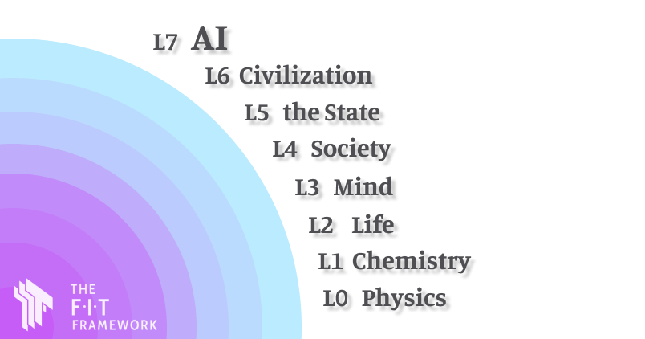
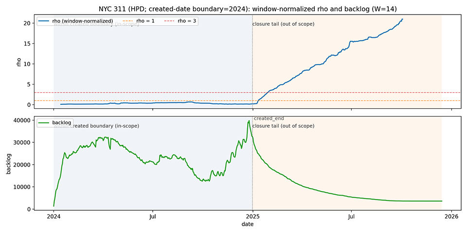
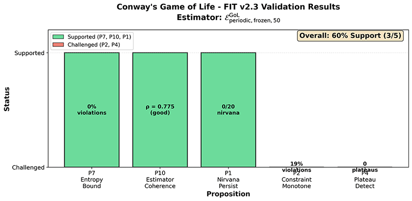

# The F-I-T (Force–Information–Time) Dynamics Framework

## A Constraint‑Driven Lens on Evolution Across Physical, Biological, Cognitive, Social, and AI Systems

[[中文/Chinese]](README.zh_cn.md)

 

**Zenodo (all versions):** https://doi.org/10.5281/zenodo.18012401 | **Latest release (v2.4.1):** https://doi.org/10.5281/zenodo.18112020   

**Papers (Zenodo):**
- **Start here – FIT (Force-Information-Time) Dynamics: Origin and Design Goals:** https://doi.org/10.5281/zenodo.18142211
- **AI safety – Irreversible Operations and Tempo Mismatch in AI Learning Systems:** https://doi.org/10.5281/zenodo.18142151
- **AI safety (grokking) – Controlled Nirvana: Emptiness Windows as a Structural Safety Mechanism for Post-Grokking AI Systems:** Zenodo https://doi.org/10.5281/zenodo.18155425 | SSRN https://papers.ssrn.com/sol3/papers.cfm?abstract_id=6023634  

**Case studies:**
- [**Li² grokking scaling-law replication (based on the Li² paper; independently verified)**](experiments/li2_scaling_law/README.md)
- [**Smartphones and the Attention System**](docs/cases/CASE_01_Phone_Attention_System.md)
- [**Content Platforms and Involution**](docs/cases/CASE_02_Content_Platform_Involution.md)
- [**Learning: From Memorization to Understanding**](docs/cases/CASE_04_Learning_From_Memory_to_Understanding.md)

*Note: names are cited as paper authors; no affiliation or endorsement is implied.*

**Structural archetypes (patterns):**
- [**Patterns (reusable templates)**](docs/patterns/README.md)

---
 
**Current spec (v2.4.1):** [docs/v2.4.md](docs/v2.4.md)  
**Framework established:** Dec 10th, 2025 (original)

**Author**: Qien Huang (Independent Researcher)  
**E-mail**: qienhuang@hotmail.com  
**License**: CC BY 4.0  
**Repository**: https://github.com/qienhuang/F-I-T  
**ORCID**: https://orcid.org/0009-0003-7731-4294

## Specs (start here)

> **Recommended order for first-time readers**: Core Card → Current Spec (v2.4) → Entry points

- **Fastest entry (Core Card, v2.4.1+)**: [docs/core/fit_core_card.md](docs/core/fit_core_card.md)
- **Current spec (v2.4.1, EST + Tier‑1 validation)**: [docs/v2.4.md](docs/v2.4.md) (EN), [docs/zh_cn/v2.4.zh_cn.md](docs/zh_cn/v2.4.zh_cn.md) (中文/Chinese)
- **Previous edition (v2.3, Tier‑1 validation)**: [docs/v2.3.md](docs/v2.3.md)
- **Legacy discussion edition (v2.1)**: [docs/v2.1.md](docs/v2.1.md)
- **Changelog**: [CHANGELOG.md](CHANGELOG.md)
- **Versioning policy**: [docs/core/Versioning_Policy.md](docs/core/Versioning_Policy.md)

> **Stability note**: 2.x core is stabilized; revisions are counterexample-driven. See [Versioning Policy](docs/core/Versioning_Policy.md).

## Why F‑I‑T?

From quantum and molecules to cells, individuals, organizations, nations, and civilizations—why do clearly defined hierarchical structures emerge? Why does evolution often manifest as a repeating rhythm of "oscillation—stability—aggregation—re-stability"? Why do many systems fail not because of insufficient power or lack of information, but because the "pace of doing things" is wrong?

I attempt to answer these questions by compressing "evolution" into three minimal variables:

- **Force (F)**: The action that drives or constrains system change (interactions, selection pressures, institutional constraints, objective function gradients).
- **Information (I)**: Structures that can persist in time and produce causal effects (codes, forms, patterns, models).
- **Time (T)**: Not a background scale, but a spectrum of characteristic time scales (rhythms) emergent from the interaction of F and I.

**F‑I‑T is a meta-framework, not a theory of a specific domain.**
Its purpose: first reduce any problem of "evolution, development, origin, collapse, innovation" to `(F, I, T)`, then discuss levels, critical points, and transition paths.

---

## What FIT Claims (and Does Not Claim)

**What FIT does NOT claim**:
- ❌ A "theory of everything" for complex systems
- ❌ Replacement for existing frameworks (Free Energy Principle, Constructor Theory, etc.)
- ❌ Ability to predict exact trajectories of complex systems
- ❌ That all propositions have been validated across all domains

**What FIT DOES claim**:
- ✅ A minimal meta-language for discussing evolution across domains
- ✅ Falsifiable through computational and empirical experiments
- ✅ Initial Tier-1 validation shows promising results in controlled systems
- ✅ Applications to AI safety and complexity science are tractable

---

## FIT v2.4 at a Glance

**The problem**: Modern science approaches evolution through fragmented lenses (thermodynamics, information theory, complexity science, ML). They succeed in isolation but lack shared axioms for cross-domain synthesis.

**FIT's response**: Compress "evolution" into five primitives and six principles. Generate 18 falsifiable propositions bound to explicit estimator tuples.

**Core insight**: Many systems fail not from lack of power or information, but because high-impact changes become irreversible faster than correction can occur. FIT treats tempo (correction timescales) as a first-class variable.

**The five primitives**:

| Primitive | Definition | Interpretation |
|-----------|------------|----------------|
| **State (S)** | $S_t \in \mathcal{S}$ | System configuration at time $t$ (or $t$ index) |
| **Force (F)** | $\mathbb{E}[S_{t+1} - S_t \mid S_t] = \alpha F(S_t, t)$ | Generalized drift / directed influence |
| **Information (I)** | $I_{\text{gain}} := H(P_0) - H(P_1)$ | Entropy reduction / knowledge gain |
| **Constraint (C)** | $C(t) := \log \lvert \mathcal{S} \rvert - \log \lvert \mathcal{S}_{\text{accessible}}(t) \rvert$ | Reachable state space reduction |
| **Time (T)** | Ordered index $t$ with characteristic scales | Emergent from F–I interaction |

**v2.4 key features**:
- **Estimator Selection Theory (EST)**: 8 admissibility axioms (A1–A8) preventing "estimator-hacking" critiques
- **18 falsifiable propositions** with explicit success/failure criteria
- **Tier-1 validation**: 97.5% theory–observation match (Langton's Ant), P7 bounds 0% violations (Conway's GoL)
- **AI safety track**: tempo mismatch + Irreversible Operations as distinct failure mode

**Read the full spec**: [docs/v2.4.md](docs/v2.4.md)

## Entry points (practical)

- **AI safety index**: [docs/ai_safety/README.md](docs/ai_safety/README.md)
- **FIT for AI Safety (start here)**: [docs/ai_safety/fit_ai_safety_mapping.md](docs/ai_safety/fit_ai_safety_mapping.md) — 5-min overview + 2-hour self-assessment checklist
- **Two-week pilot (teams)**: [proposals/tempo-io-pilot.md](proposals/tempo-io-pilot.md) + [proposals/tempo-io-pilot-pack/](proposals/tempo-io-pilot-pack/)
- **Self-referential IO standard**: [docs/ai_safety/self_referential_io.md](docs/ai_safety/self_referential_io.md) + [docs/ai_safety/io_sr_mapping.md](docs/ai_safety/io_sr_mapping.md)
- **CPU-first local agent blueprint (16GB RAM, DeepSeek distill)**: [papers/cpu-first-local-agent-on-16gb-deepseek-distill.v0.2.md](papers/cpu-first-local-agent-on-16gb-deepseek-distill.v0.2.md)
- **CPU-first local agent demo (action gate + audit log)**: [examples/cpu_first_local_agent_demo/README.md](examples/cpu_first_local_agent_demo/README.md)
- **Case note (R1-style RL + risk control)**: [docs/ai_safety/deepseek_r1_fit_case_note.md](docs/ai_safety/deepseek_r1_fit_case_note.md) — defense-in-depth: content gating + action gating
- **Li² replication protocol (one-click)**: [experiments/li2_scaling_law/FIT_VALIDATION_README.md](experiments/li2_scaling_law/FIT_VALIDATION_README.md) + [experiments/li2_scaling_law/run_fit_validation.py](experiments/li2_scaling_law/run_fit_validation.py)
- **Cloud runners (Li²)**: [experiments/li2_scaling_law/colab_li2_scaling_law.ipynb](experiments/li2_scaling_law/colab_li2_scaling_law.ipynb) (Colab) + [experiments/li2_scaling_law/aistudio_paddle_script_task/README.md](experiments/li2_scaling_law/aistudio_paddle_script_task/README.md) (Baidu AI Studio, Paddle)
- **Runnable demo**: [examples/self_referential_io_demo.ipynb](examples/self_referential_io_demo.ipynb) + [examples/run_demo.py](examples/run_demo.py)
- **Tier-2.5 demonstration (preregistered)**: [experiments/real_world/nyc_311_tier2p5/](experiments/real_world/nyc_311_tier2p5/) — NYC 311 service requests; applying FIT metrics to real-world data (not a validation claim)
- **arXiv anchor draft (IO × tempo mismatch)**: [papers/irreversible-operations-tempo-mismatch.arxiv.compact.md](papers/irreversible-operations-tempo-mismatch.arxiv.compact.md)

### Tier‑2.5 (NYC 311) — decision view

This is a **preregistered demonstration** (not a "real-world validation" claim). The vertical marker indicates the **created-date boundary**: arrivals are filtered to 2024 by construction, while closures may continue into 2025 (a closure tail that is **out of scope** for H1 under this boundary).

**Current reading (HPD 2024; W=14, H=14)**: coherence gate PASS, but H1 is **INCONCLUSIVE** because there are **0 in-scope tempo-mismatch events** (rho stays < 1 within the created-date boundary).

Reproducibility + guardrails: [prereg_v3.yaml](experiments/real_world/nyc_311_tier2p5/prereg_v3.yaml) and [experiment README](experiments/real_world/nyc_311_tier2p5/README.md).

## Tier-1 evidence (toy systems)

- **Langton's Ant (open boundary)**: 97.5% theory–observation match for net displacement; supports key phase-transition / nirvana predictions.
- **Conway's Game of Life**: P7 information bounds (0% violations), P10 estimator coherence (rho = 0.775); P2 constraint monotonicity challenged under current estimator.

*Figure: Conway's Game of Life Tier‑1 validation snapshot (details in [docs/v2.4.md](docs/v2.4.md)).*

## Roadmap

| Milestone | Goal | Horizon |
|-----------|------|---------|
| **M0** | Stabilize 2.x spec; publish Tier-1 validation scripts (GoL, Langton's Ant) | 0–3 mo |
| **M1** | Reference Python implementations; 5–8 propositions with reproducible status | 3–9 mo |
| **M2** | Continuous-time FIT (SDE layer); prove constraint-accumulation theorem | 6–18 mo |
| **M3** | Quantum FIT (Lindbladian layer); demonstrate quantum analogues of P2/P3 | 9–24 mo |
| **M4** | Merge discrete / continuous / quantum into unified v3.0 | 18–36 mo |
| **M5** | Applications: AI safety, complexity science, institutional design | ongoing |

**Full roadmap**: [docs/roadmap.v2.4.md](docs/roadmap.v2.4.md)

## Repository map

- `docs/` - specifications and notes
- `proposals/` - practitioner pilots and templates
- `docs/ai_safety/` - self-referential IO and governance docs
- `examples/` and `experiments/` - runnable demos and validation artifacts
- `papers/` - drafts and venue-specific writeups
- `CITATION.cff` - citation metadata for this repository

## Citation

Use `CITATION.cff` for copy/paste formats, or cite via Zenodo:

- Zenodo (all versions): https://doi.org/10.5281/zenodo.18012401
- Latest release (v2.4.1): https://doi.org/10.5281/zenodo.18112020

## License

Text and documentation in this repository are licensed under **CC BY 4.0**.

## AI-assisted drafting disclosure

Portions of drafting and editing were assisted by large language models. The author takes full responsibility for all content, claims, and errors.

