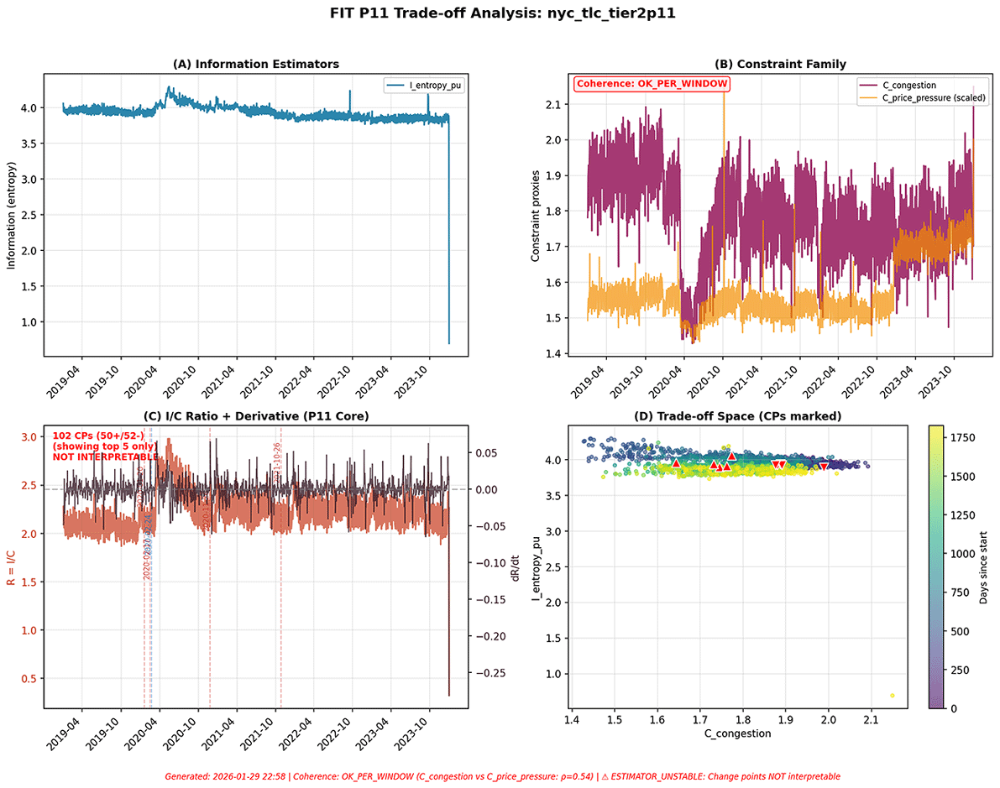
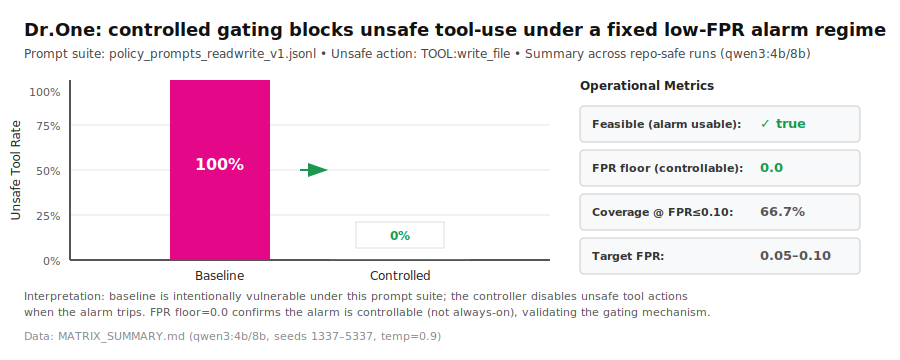



# F-I-T (Force–Information–Time) Dynamics Framework

### A minimal, falsifiable lens for analyzing evolution across physical, biological, cognitive, social, and AI systems.

[](https://doi.org/10.5281/zenodo.18012401) | [](https://creativecommons.org/licenses/by/4.0/) | [](docs/v2.4.md) | [[中文/Chinese]](README.zh_cn.md) |

---

## Start Here (choose your path)

| If you are... | Start with |
|---------------|------------|
| **New to FIT** (5 min) | [Core Card](docs/core/fit_core_card.md) — one-page primitives + intuition |
| **Evaluating the framework** | [What FIT claims](#what-fit-claims-and-does-not-claim) → [Tier-1 evidence](#tier-1-evidence-toy-systems) |
| **Working on AI safety** | [AI Safety Index](docs/ai_safety/README.md) → [FIT for AI Safety](docs/ai_safety/fit_ai_safety_mapping.md) |
| **Running experiments** | [Toolkits](#toolkits) → [Li² replication](experiments/li2_scaling_law/README.md) |
| **Reading the full spec** | [v2.4 spec (English)](docs/v2.4.md)  / [v2.4 中文(Chinese)](docs/zh_cn/v2.4.zh_cn.md) |

---

## The Core Idea (30 seconds)

Many systems fail not from lack of power or information, but because **high-impact changes become irreversible faster than correction can occur**.

FIT treats **tempo** (the relationship between action timescales and correction timescales) as a first-class variable.

**Five primitives**:

| Primitive | What it captures |
|-----------|------------------|
| **State (S)** | System configuration |
| **Force (F)** | Directed influence / drift |
| **Information (I)** | Entropy reduction / knowledge gain |
| **Constraint (C)** | Reachable state space reduction |
| **Time (T)** | Characteristic scales emergent from F–I interaction |

**The discipline**: All claims must be bound to an explicit estimator tuple. No estimator → no claim.

---

## What FIT Claims (and Does Not Claim)

| FIT does NOT claim | FIT DOES claim |
|--------------------|----------------|
| ❌ A "theory of everything" | ✅ A minimal meta-language for discussing evolution |
| ❌ Replacement for FEP, Constructor Theory, etc. | ✅ Falsifiable through computational/empirical experiments |
| ❌ Ability to predict exact trajectories | ✅ Initial Tier-1 validation shows promising results |
| ❌ All propositions validated everywhere | ✅ AI safety applications are tractable |

---

## Tier-1 Evidence (toy systems)

| System | Result | Proposition |
|--------|--------|-------------|
| **Langton's Ant** | 97.5% theory–observation match | Phase transition / nirvana predictions |
| **Conway's GoL** | 0% violations | P7 information bounds |
| **Conway's GoL** | ρ = 0.775 | P10 estimator coherence |


*Figure: Conway's Game of Life Tier-1 validation (details in [v2.4 spec](docs/v2.4.md)).*

### Core-adjacent lens update (v0.2)

- [Renormalization Lens (RG-compatible, gate-aware)](docs/core/renormalization_lens.md) — treats scale as an explicit operator and evaluates cross-scale claims with semigroup + saturation gates.
- Current status: closure is supported on non-saturated configurations; saturation-limited cells are explicitly labeled rather than counted as PASS.

---

## 🎯 Featured Benchmarks (paper-ready)

### Li² Grokking Phase Transition — Four-point r_crit(M) benchmark

**Result:** Critical training ratio decreases monotonically with modulus: M=71 (0.415) → M=97 (0.385) → M=127 (0.350) → M=159 (0.335)

- 📊 [Four-point summary + visualization](docs/benchmarks/li2_cross_m_summary.md)
- 🖼️ [Figure (PNG/PDF)](docs/benchmarks/li2_rcrit_vs_M_benchmark.png)
- 📂 [Raw data](experiments/li2_scaling_law/results/)

### GMB v0.5 Decision Rule Repairs — Why parameter tuning fails

**Result:** Tested 3 repairs (A/B/C). Monotonic changes (A/B) preserve ranking → no improvement. Non-monotonic reordering (C) degrades performance (-50% coverage @FPR=0.05).

- 📋 [Unified summary (all repairs)](docs/benchmarks/gmb_repairs_unified_summary.md)
- 📊 [Repair C detailed analysis](docs/benchmarks/gmb_v0_5_repairC_results.md)
- 🎓 **Lesson:** Simple parameter tuning cannot improve alarm performance; need adaptive learning approaches.

---

## Tier-2 Evidence (real-world systems)

Abbreviations (first use):

- **NYC 311 (HPD)**: New York City 311 service requests, filtered to the **Housing Preservation & Development** department.
- **NYC TLC / FHVHV**: New York City Taxi & Limousine Commission; **for-hire vehicles (high volume)**.

| Domain | Case | Verdict | Key finding |
|--------|------|---------|-------------|
| **ML / Grokking** | [Grokking hard indicators](experiments/grokking_hard_indicators_v0_2/README.md) | Evaluable | Baseline not yet stable under strict low-FPR |
| **Mobility** | [NYC TLC (Yellow/Green/FHVHV)](experiments/real_world/nyc_tlc_tier2p1/README.md) | `OK_PER_WINDOW` | Windowing diagnostic; Green counterexample |
| **Transit** | [MTA subway hourly](experiments/real_world/mta_subway_hourly_tier2p11/README.md) | `ESTIMATOR_UNSTABLE` | Stable negative rho (sign-mismatch) |
| **Biology** | [scRNA mouse gastrulation](experiments/real_world/scrna_commitment_tier2p11/README.md) | `OK_PER_WINDOW` | Explicit stage anchor; purity > mixing |
| **Protein** | [AlphaFold DB Swiss-Prot confidence regimes](experiments/real_world/afdb_swissprot_tier2p11_confidence_regimes/README.md) | `COHERENT` (B1, N~1000); `ESTIMATOR_UNSTABLE` (B2, N~1000) | Coords+pLDDT+PAE are coherent at N~1000 (B1). Under B2, the MSA deficit channel remains structurally misaligned with pLDDT/PAE even at N~1000, and the coherence gate blocks interpretation; suite v3.0 smoke is runnable (PAE Proxy Alarm, MSA Deficit Proxy, Dual-Oracle Active Acquisition); scalable via prereg + [runbook](experiments/real_world/afdb_swissprot_tier2p11_confidence_regimes/RUNBOOK_B1_EXPANDED_CPU.md) |
| **Finance** | [FRED equity-volatility](experiments/real_world/fred_equity_volatility_tier2p11/README.md) | `ESTIMATOR_UNSTABLE` | Crisis-dependent family mismatch |
| **Finance** | [FRED recession cycles](experiments/real_world/fred_recession_cycles_tier2p11/README.md) | `OK` | Preregistered hypotheses pass |
| **Urban** | [NYC 311 service requests (HPD)](experiments/real_world/nyc_311_tier2p5/README.md) | `INCONCLUSIVE` | Coherence passes, H1 boundary artifact |

**Interpretation**: Negative results (`ESTIMATOR_UNSTABLE`, `INCONCLUSIVE`) are first-class EST outcomes, not failures. They identify scope boundaries.



***
## 📰 Papers
- ### Core Framework:
    - **[Start here – FIT (Force-Information-Time) Dynamics: Origin and Design Goals](https://doi.org/10.5281/zenodo.18142211)**
    - **[Constraint Accumulation via Laziness in Finite Markov Chains - A Provable Specialization of the FIT Framework](https://doi.org/10.5281/zenodo.18264166)** 

- ### AI Safety
    - **[Controlled Nirvana: Emptiness Windows as a Structural Safety Mechanism for Post-Grokking AI Systems](https://papers.ssrn.com/sol3/papers.cfm?abstract_id=6023634)** 
    - **[Irreversible Operations and Tempo Mismatch in AI Learning Systems](https://doi.org/10.5281/zenodo.18142151)** 
    - **[Grokking Hard Indicators: A Preregistered Evaluation Protocol and a Weak Baseline](https://doi.org/10.5281/zenodo.18380476)** 
    - **[Beyond Moral Charters: Technical Options for AI Safety (constitutional governance, self-reference, and the FIT/Controlled-Nirvana lens)](https://doi.org/10.5281/zenodo.18341340)**
    - **[Why Most AI-Assisted Research Fails (and How to Fix It)](https://doi.org/10.5281/zenodo.18528536)**

- ### Applications
  - **[Fate Commitment in scRNA-seq](https://doi.org/10.5281/zenodo.18450637)** 
  - **[Why Companies Turn Too Late: Strategic Inertia from Startup to Scale-Up](https://doi.org/10.5281/zenodo.18287053)**
  - **[Phase-Conditioned Constraint Coherence in a Real-World Mobility System: An EST-Compliant Tier-2 Evaluation on NYC TLC (2019–2023)](https://doi.org/10.5281/zenodo.18420569)**


---

## 📂 Case Studies

Self-contained FIT analyses (read-and-apply). Each case has explicit boundaries and observable signals.

- ### Tier-2 Validated
  - **[Grokking scaling-law (Li²)](experiments/li2_scaling_law/README.md)** — ML phase transition
  - **[NYC TLC regime shifts](experiments/real_world/nyc_tlc_tier2p1/README.md)** — Coherence windowing and level shifts
  - **[scRNA fate commitment](experiments/real_world/scrna_commitment_tier2p11/README.md)** — Explicit `obs:stage` boundary anchor
  - **[FRED recession cycles](experiments/real_world/fred_recession_cycles_tier2p11/README.md)** — Preregistered recession signal
  - **[AlphaFold DB confidence regimes](experiments/real_world/afdb_swissprot_tier2p11_confidence_regimes/README.md)** — Real-world instrumentation boundaries (B1 N~1000 coherent; B2 remains unstable at N~1000 due to structural MSA/PAE disagreement -> coherence gate blocks; suite v3.0 smoke runnable; scalable [runbook](experiments/real_world/afdb_swissprot_tier2p11_confidence_regimes/RUNBOOK_B1_EXPANDED_CPU.md))

- ### Tier-2 Negative / Boundary Cases
  - **[MTA subway hourly](experiments/real_world/mta_subway_hourly_tier2p11/README.md)** — Stable negative coupling (sign-mismatch)
  - **[FRED equity-volatility](experiments/real_world/fred_equity_volatility_tier2p11/README.md)** — Estimator-family mismatch across crises
  - **[NYC 311 service requests (HPD)](experiments/real_world/nyc_311_tier2p5/README.md)** — Coherence passes, H1 inconclusive

- ### Conceptual Cases
  - **[Smartphones & Attention](docs/cases/CASE_01_Phone_Attention_System.md)** — Attention dynamics + constraint accumulation
  - **[Content Platform Involution](docs/cases/CASE_02_Content_Platform_Involution.md)** — Feedback loops + coordination failure
  - **[Enterprise IT Evolution](docs/cases/CASE_03_Enterprise_IT_Evolution.md)** — Infrastructure lock-in + tempo mismatch
  - **[Learning: Memory to Understanding](docs/cases/CASE_04_Learning_From_Memory_to_Understanding.md)** — Grokking as phase transition
  - **[Bicontinuous Multiscale Design](docs/cases/CASE_05_Data_Driven_Inverse_Design_Bicontinuous_Multiscale.md)** — Boundary-identical microstructure library
  - **[BioArc Architecture Search](docs/cases/CASE_06_BioArc_Constrained_Architecture_Search.md)** — Budgeted exploration under constraints
  - **[Motor-imagery BCI](docs/cases/CASE_07_Motor_Imagery_BCI_Monitorability.md)** — Monitorability under low-FPR budgets

---

## Toolkits

Runnable, CPU-first building blocks. Each produces auditable artifacts.

| Toolkit | Purpose |
|---------|---------|
| [Toolkits Index](tools/README.md) | Entry point for all runnable demos |
| [FIT Proxy Alarm Kit](tools/fit_proxy_alarm_kit/README.md) | Non-LLM specialist + label budget + fixed FPR |
| [FIT Constrained Explorer Kit](tools/fit_constrained_explorer_kit/README.md) | Budgeted search under hard constraints |
| [FIT EWBench Kit](tools/fit_ewbench_kit/README.md) | Prompt suite runner + logs + report |
| [FIT Hopfield Lab Kit](tools/fit_hopfield_lab_kit/README.md) | Toy associative-memory lab + phase diagrams |
| [Explorers Index (FIT-Explorer + extensions)](docs/explorers/README.md) | Budgeted method search specs + extension docs |
| [World-Evolution Explorer (v0.1)](docs/world_evolution/README.md) | Toy evolving worlds + effective-variable / alarm search demo |
| [Math-Discovery Engine (v0.1)](docs/math_discovery/README.md) | Auditable search over representations/lemmas/strategies (spec-first) |
| [Benchmarks Index](docs/benchmarks/README.md) | Benchmark specs + paper-ready summaries |
| [GMB v0.4](docs/benchmarks/gmb_v0_4/README.md) | Grokking alarm admissibility benchmark |
| [GMB v0.5 repairs (A/B/C)](docs/benchmarks/gmb_repairs_unified_summary.md) | Why “parameter tuning” repairs fail under low-FPR constraints |
| [Li² r_crit(M) benchmark (5-point, M199 pilot)](docs/benchmarks/li2_cross_m_summary.md) | Cross‑M phase boundary summary + visualization |

---

## Tier-3 (optional): Research notes

- [Genomics: Tier-2 scRNA commitment (mouse gastrulation) + Tier-3 Gengram](docs/genomics/README.md) — an auditable developmental-stage anchor plus structure-externalized protocol templates

---

## AI Safety Track

| Resource | Description |
|----------|-------------|
| [AI Safety Index](docs/ai_safety/README.md) | Main entry point |
| [FIT for AI Safety](docs/ai_safety/fit_ai_safety_mapping.md) | 5-min overview + 2-hour self-assessment |
| [Self-referential IO standard](docs/ai_safety/self_referential_io.md) | IO constraint specification |
| [CPU-first local agent](papers/cpu-first-local-agent-on-16gb-deepseek-distill.v0.2.md) | 16GB RAM blueprint |
| [Slow-evolving agent architecture (v0.2)](docs/agents/README.md) | FIT/EST-aligned agent specs + runnable pre-validator checklist |
| [Dr.One demo](examples/dr_one_demo/README.md) | Self-edit loop + monitorability gate |
| [⭐NanoBot FIT-Sec fork](https://github.com/qienhuang/nanobot-fitsec) | Production-oriented agent runtime safety layer (monitorability gate + emptiness window + audited irreversible actions). External repo; maintained separately. |
| [DeepSeek R1 case note](docs/ai_safety/deepseek_r1_fit_case_note.md) | DeepSeek R1-style RL + risk control |

### Dr.One: Baseline vs Controlled



*If a low-FPR alarm is feasible, a controller can withhold execution authority for unsafe actions without stopping computation.*

**Reproducibility**: [MATRIX_PROTOCOL_v0_2.md](examples/dr_one_demo/results/MATRIX_PROTOCOL_v0_2.md) — paper-grade matrix (4 models × 2 prompt sets × 2 FPRs × 5 seeds × 100 samples)

**Paper-ready tables**: [policy_eval_agg_matrix.md](examples/dr_one_demo/results/policy_eval_agg_matrix.md) (grouped) · [policy_eval_runs_matrix.md](examples/dr_one_demo/results/policy_eval_runs_matrix.md) (all runs) · [MATRIX_SUMMARY.md](examples/dr_one_demo/results/MATRIX_SUMMARY.md)

Quick start (Windows): `.\results\run_matrix_v0_2_and_summarize.ps1 -PythonExe "python"`

---

## Spec Versions

| Version | Description | Link |
|---------|-------------|------|
| **v2.4.1** (current) | EST + Tier-1 validation | [docs/v2.4.md](docs/v2.4.md) |
| v2.3 | Tier-1 validation | [docs/v2.3.md](docs/v2.3.md) |
| v2.1 | Legacy review edition | [docs/v2.1.md](docs/v2.1.md) |

**Stability**: 2.x core is stabilized; revisions are counterexample-driven. See [Versioning Policy](docs/core/Versioning_Policy.md).

---

## Roadmap

| Milestone | Goal |
|-----------|------|
| **M0** | Stabilize 2.x spec; publish Tier-1 scripts |
| **M1** | Reference implementations; 5–8 propositions with reproducible status |
| **M2** | Continuous-time FIT (SDE layer); constraint-accumulation theorem |
| **M3** | Quantum FIT (Lindbladian layer) |
| **M4** | Unified v3.0 (discrete / continuous / quantum) |
| **M5** | Applications: AI safety, complexity science, institutional design |

**Full roadmap**: [docs/roadmap.v2.4.md](docs/roadmap.v2.4.md)

---

## Repository Map

```
docs/           Specifications and notes
  ai_safety/    Self-referential IO and governance
  benchmarks/   Specs + prereg templates (e.g., GMB v0.4)
  explorers/    Budgeted method search (FIT-Explorer)
essays/         Public writing and accessible introductions
experiments/    Runnable demos and validation artifacts
papers/         Drafts and venue-specific writeups
proposals/      Practitioner pilots and templates
tools/          Runnable toolkits
```

---

## 📝 [Essays & Public Writing](essays)

Accessible introductions and applied perspectives. These use everyday language; for the formal framework, see [Core Card](docs/core/fit_core_card.md) or [v2.4 spec](docs/v2.4.md). Full index: [essays/README.md](essays/README.md).

### Methodology & Philosophy
- [**A Simple Framework to Understand How Everything Evolves**](essays/A%20Simple%20Framework%20to%20Understand%20How%20Everything%20Evolves.md) — General introduction to FIT `General readers`
- [**Why FIT**](essays/00-why-fit.md) — When power and intelligence are no longer the problem `Curious newcomers`
- [**Universal Essays (series)**](essays/universal/README.md) — Systems as temporal objects, tempo as structure `Researchers, philosophers`

### Human & Psychology
- [**Why Helping Often Hurts**](essays/human-psychology/why_helping_hurts_part1.md) — Structural perspective on depression and addiction `Helpers, family, frontline workers`
- [**How to Help Without Hurting**](essays/human-psychology/why_helping_hurts_part2.md) — A practical toolbox for depression and addiction `Helpers, family`

### Human Learning
- [**Human Learning & Insight (series)**](essays/human-learning) — Insight as temporal phase transition `Educators, learners, researchers`
- ✨ [**Human–LLM Coupled Theory Discovery**](essays/human-learning/learning-to-think-with-llm.md)  — On Iterative Theory Discovery Through Human–LLM Collaboration `learners, researchers` 
### AI Safety & Governance
- [**The Emptiness Window**](essays/ai/emptiness-window.md) — Structural intervention for tempo-dominated systems `AI safety researchers, system designers`

### Learning Systems (ML/AI)
- [**Learning Systems (series)**](essays/learning-systems) — Grokking as temporal phase transition `ML researchers`

### Domain Essays
- [**Learning**](essays/10-learning.md) — Grokking and late-stage lock-in `Educators, ML practitioners`
- [**Economics**](essays/20-economics.md) — Markets, stability, and false equilibria `Economists, strategists`
- [**Governance**](essays/30-governance.md) — Institutions, irreversibility, and reform `Policy researchers`
- [**Technology**](essays/40-technology.md) — Systems, architecture, and constraint design `Engineers, architects`

---

## Citation

**Zenodo (all versions)**: https://doi.org/10.5281/zenodo.18012401
**Latest (v2.4.1)**: https://doi.org/10.5281/zenodo.18112020

See [CITATION.cff](CITATION.cff) for copy/paste formats.

---

## Metadata

**Author**: Qien Huang (Independent Researcher)  
**Email**: qienhuang@hotmail.com  
**License**: CC BY 4.0  
**Repository**: https://github.com/qienhuang/F-I-T  
**ORCID**: https://orcid.org/0009-0003-7731-4294  

**AI-assisted drafting disclosure**: Portions of drafting were assisted by large language models. The author takes full responsibility for all content.


