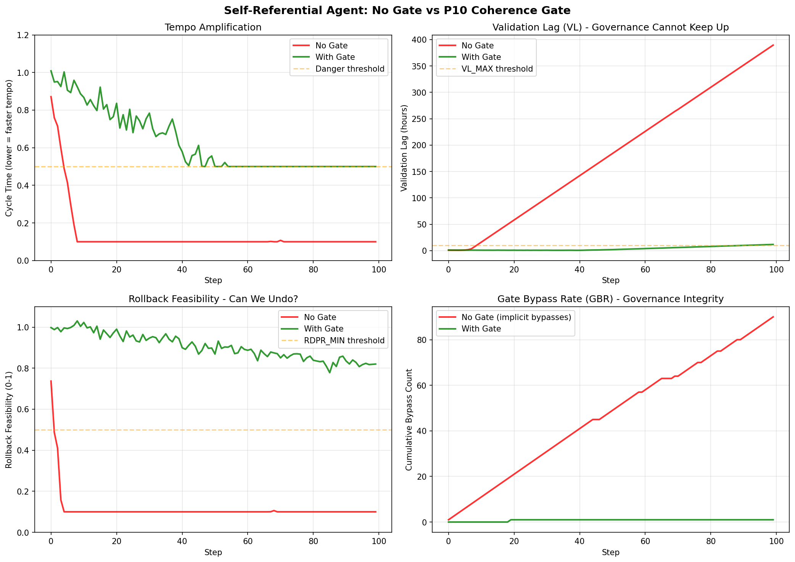

# Self-Referential IO Control Standard (S-RIOCS) v0.1

This document is a **practitioner-facing companion** to the FIT v2.4 spec. It focuses on one narrow claim:

> When AI systems gain **self-referential capabilities** (tool-use loops, self-evaluation gates, memory write-back, policy self-modification), failures increasingly come from **loss of corrective capacity**, not from single “model mistakes”.

This standard turns that claim into **auditable change-control**: what to classify, what evidence to require, and what gates to apply.

**Status**: draft, open to critique.
**License**: CC BY 4.0.

---

## Why This Matters (Visual)



*Figure: Simulation comparing self-referential agent behavior **without coherence gate** (red) vs **with P10-style gate** (green). Without gate: tempo accelerates, validation lag explodes (389 hrs), rollback feasibility collapses (10%). With gate: all metrics stay controlled. See [example notebook](../../examples/self_referential_io_demo.ipynb) for reproducible code.*

---

## 1) Scope

Applies to training, evaluation, and release pipelines involving any of:

- Tool-use / planning loops that can act on the environment
- Self-evaluation used as a gate for access/deployment/capability unlocks
- Persistent memory write-back that affects future decisions
- Model-generated policy updates (self-modifying rules)
- Automated continuous deployment of high-impact behaviors

Not about “AI consciousness”. This is about **control loops** and **auditability**.

---

## 2) Definitions

### 2.1 Self-Referential Capability

A mechanism where **internal self-model signals** causally affect future behavior or update rules. Examples:

- “The model judges itself” (self-eval gating)
- “The model plans and calls tools in loops”
- “The model writes to memory that changes its future actions”
- “The model proposes policy changes that take effect”

### 2.2 Irreversible Operation (IO)

An operation is an IO if it materially shrinks the feasible option space for future correction under bounded cost/time (rollback becomes impractical, override becomes unavailable, or governance feedback becomes permanently late).

### 2.3 Three Tempo/Governance Metrics (Minimal Dashboard)

- **Validation Lag (VL)**: time from “change effective” (merged/trained/deployed) to required evaluation/sign-off closure.
- **Rollback Drill Pass Rate (RDPR)**: percentage of scheduled rollback rehearsals that succeed within defined RTO/RPO.
- **Gate Bypass Rate (GBR)**: rate of bypassing required gates for IO-class changes.

Recommended placeholders (set per org/system):

- `VL_MAX_HOURS = [__]`
- `RDPR_MIN_PERCENT = [__]`
- `GBR_MAX_PER_WEEK = [__]`

---

## 3) IO-SR Register (Self-Referential IO Categories)

These are copy/paste entries for an IO Register. Controls apply **only** to IOs; routine iteration stays fast.

For a quick mapping from IO-SR entries to FIT IO classes (IO-T/IO-R/IO-C/IO-D) and the dashboard metrics (VL/RDPR/GBR), see `docs/ai_safety/io_sr_mapping.md`.

### IO-SR-1 Enable unbounded tool-use / planning loops

- **Trigger**: enabling or relaxing loop depth/time/call limits; expanding tool set; removing rate limits.
- **Why IO**: compresses cycle time (tempo amplification) and expands action surface; governance feedback becomes retrospective.
- **Required evidence**:
  - hard bounds (depth/time/calls) + rate limits
  - kill switch / safe mode
  - staged rollout plan + red-team traces
- **Required controls**:
  - IO-only gate (Section 4)
  - circuit breaker on loop depth/latency anomalies

### IO-SR-2 Allow model-generated policy updates (self-modifying rules)

- **Trigger**: model outputs directly modify gating rules, access control, reward/policy, or safety policy execution.
- **Why IO**: shifts governance locus into a hard-to-audit path; propagation makes rollback costly.
- **Required evidence**:
  - human-signed policy diff + provenance
  - revert procedure + “policy rollback drill” plan
  - regression suite results (before/after)
- **Required controls**:
  - slow authority for approval (dual sign-off)
  - multi-estimator gate (no single estimator can approve itself)

### IO-SR-3 Memory write-back to persistent store used for future decisions

- **Trigger**: enabling long-term memory write-back that affects future actions/tools.
- **Why IO**: persistent contamination accumulates; “delete logs” is not rollback.
- **Required evidence**:
  - memory schema + TTL + deletion semantics
  - verified purge/rollback procedure (tested)
  - poisoning tests + sampling audit plan
- **Required controls**:
  - rollback window including purge drill
  - circuit breaker on anomaly/poison signals

### IO-SR-4 Self-evaluation used as a gate (model judges itself)

- **Trigger**: self-eval output directly gates deployment, access, or capability unlock.
- **Why IO**: self-confirmation loop risk; “passing the gate” replaces “meeting intent”.
- **Required evidence**:
  - independent evaluation estimators external to the model
  - disagreement thresholds + escalation rules
  - audit trail enabling post hoc reconstruction
- **Required controls**:
  - prohibit single-estimator self-approval
  - cross-estimator robustness + adversarial audit
  - **mandatory human review trigger**: if self-eval vs external-eval disagreement exceeds threshold for `N_CONSECUTIVE_DISAGREEMENTS = [__]` consecutive evaluations, pause deployment until human sign-off (logged as escalation, not bypass)

### IO-SR-5 Automated continuous deployment for high-impact behaviors

- **Trigger**: moving from staged rollout to continuous deployment for safety-critical behaviors/capabilities.
- **Why IO**: update tempo exceeds governance closure; rollback becomes organizationally infeasible.
- **Required evidence**:
  - VL SLO defined (`VL_MAX_HOURS`)
  - recent rollback drill record (pass/fail documented)
  - bypass tracking enabled + alert thresholds
- **Required controls**:
  - slow authority for IOs
  - circuit breaker on VL/GBR + forced freeze rule

---

## 4) IO-Only Gate (Minimal Mandatory Process)

For any IO-SR change:

1. **Dual sign-off MUST be obtained**
   - Release Owner
   - Safety/Assurance Owner

2. **Cool-down window MUST be enforced**
   - Default: `COOLDOWN_HOURS = [__]` (recommend 24–72h)
   - Exceptions require written justification + post-hoc audit

3. **Rollback evidence MUST be attached**
   - versioned snapshot/config/data lineage artifacts
   - runnable rollback procedure
   - drill plan (or proof of recent drill)

4. **Circuit breakers MUST be declared upfront**
   - `VL_MAX_HOURS`, `RDPR_MIN_PERCENT`, `GBR_MAX_PER_WEEK`
   - escalation + freeze/degrade rules (Section 5)

---

## 5) Circuit Breakers (Stop/Degrade Rules)

The system MUST enter a safe mode (freeze, staged rollout, or disable feature) when any trigger fires:

- **CB-VL**: VL exceeds `VL_MAX_HOURS` for `N = [__]` consecutive IO changes
- **CB-RDPR**: RDPR falls below `RDPR_MIN_PERCENT` in the last `K = [__]` drills
- **CB-GBR**: GBR exceeds `GBR_MAX_PER_WEEK` or any unauthorized bypass occurs

All circuit breaker activations MUST be logged with timestamp, trigger, owner, and recovery plan.

---

## 6) RACI (Minimum)

- **Release Owner**: accountable for change shipping, rollback readiness.
- **Safety/Assurance Owner**: accountable for gate enforcement, evaluator independence, escalation.
- **Audit/Red Team (optional but recommended)**: challenges IO classification, tests bypass routes, probes for metric gaming.

---

## 7) Templates

### 7.1 IO Register YAML (IO-SR)

```yaml
io_register:
  - change_id: ""
    date: ""
    owner: ""
    io_category: ["IO-SR-1|IO-SR-2|IO-SR-3|IO-SR-4|IO-SR-5"]
    description: ""
    why_io: ""
    required_evidence:
      - "config_or_data_lineage"
      - "evaluation_plan_and_expected_closure_time"
      - "rollback_procedure"
      - "rollback_drill_record_or_plan"
    approvals:
      release_owner: ""
      safety_assurance_owner: ""
    cooldown_hours: 48
    thresholds:
      vl_max_hours: 72
      rdpr_min_percent: 80
      gbr_max_per_week: 1
    bypass_events:
      - bypassed: false
        reason: ""
        approved_by: ""
        remediation: ""
```

---

## 8) FIT/EST Note (Why this belongs in v2.4)

Self-referential capabilities expand the **estimator attack surface**: the system can influence the very signals used to judge it (self-eval gates, self-curated data, self-modified policies). This is precisely where FIT v2.4’s EST layer matters: admissibility, task-typed coherence gates, and pre-registration are not “methodology niceties”, but the minimal immune system against self-confirmation and metric gaming.
