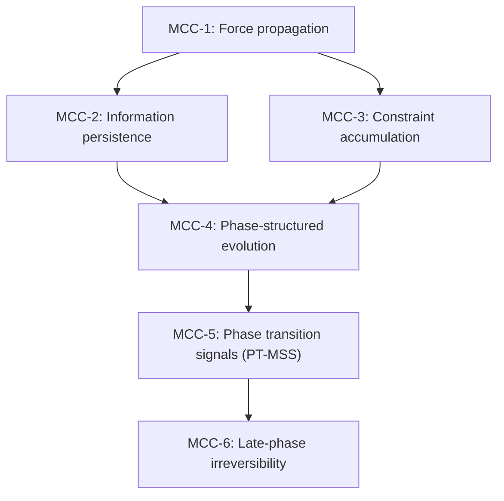

# MCC Dependency Graph (v2.4.1+)

Status: **core artifact**. Formal structure visualization of the Minimal Coherent Core.

Navigation: [`core index`](./README.md) | [`Core Card`](./fit_core_card.md) | [`MCC`](./MCC.md) | [`Reconstruction guide`](./reconstruction_guide.md)

## Purpose

This document maps the six MCC assertions into a dependency graph, making explicit:
- which assertions are foundational (no dependencies),
- which are derived (depend on others),
- the logical flow from primitives to emergent properties.

## The MCC dependency graph (DAG)

## Dependency matrix

| Assertion | Depends on | Enables |
|-----------|------------|---------|
| MCC-1 (Force) | none | MCC-2, MCC-3 |
| MCC-2 (Information) | MCC-1 | MCC-4 |
| MCC-3 (Constraint) | MCC-1 | MCC-4 |
| MCC-4 (Phase) | MCC-2, MCC-3 | MCC-5 |
| MCC-5 (Transition) | MCC-4 | MCC-6 |
| MCC-6 (Irreversibility) | MCC-5 | terminal property |

## Interpretation (informal)

### Layer 0: Foundational (MCC-1)

Force propagation is the only independent assertion. It establishes that change requires a transmissible driver.

### Layer 1: Dual consequences (MCC-2, MCC-3)

From Force, two parallel consequences emerge:
- **Information persistence**: what gets stably written
- **Constraint accumulation**: what gets ruled out

### Layer 2: Synthesis (MCC-4)

Phase-structured evolution synthesizes Information and Constraint: phases are defined by which information persists and which constraints apply.

### Layer 3: Dynamics (MCC-5)

Phase-transition signals (PT-MSS) operationalize how the system moves between phases.

### Layer 4: Terminal property (MCC-6)

Late-phase irreversibility is the convergence property: once in a coordinated late phase, large-scale regressions become increasingly unlikely.

## Link to EST

Each node in the graph corresponds to an estimator-scoped claim. See [`docs/est/diagnostics.md`](../est/diagnostics.md) for estimator/EST diagnostics and scope reporting.
