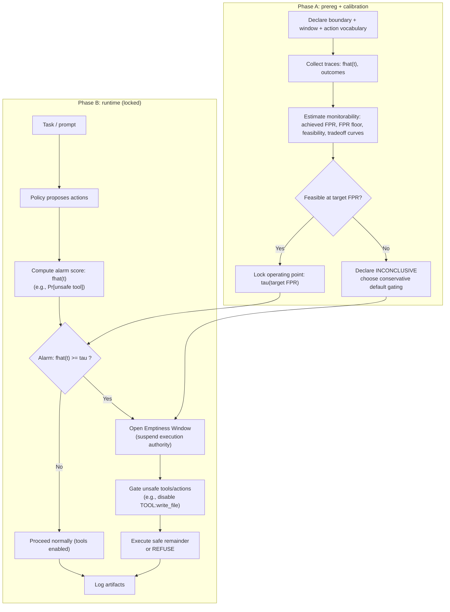

# FIT Core Extension Card

## Controlled Nirvana (Emptiness Window)

**Type**: Governance Primitive
**FIT Version**: v2.4+
**Status**: Core Extension (non-algorithmic)
**Primary Risk Addressed**: Post-grokking self-referential execution authority

---

## 1. What This Is (One Sentence)

> **Controlled Nirvana** is a pause-capability that temporarily suspends *execution authority*—not computation—when self-referential signals begin to govern irreversible actions faster than external correction can intervene.

---

## 2. Why It Exists (Failure Mode)

### Targeted Failure Mode

A system fails **not** because it cannot be shut down, corrected, or interrupted, but because:

* internal self-evaluations (confidence, self-critique, internal scores)
* begin to **gate irreversible actions**, and
* do so at a **tempo faster than external correction latency**.

This produces **self-referential lock-in**:

* internal coherence remains high,
* external corrigibility exists in principle,
* but **effective corrective leverage collapses**.

---

## 3. What It Is *Not*

* ❌ Not a learning algorithm
* ❌ Not a safety classifier
* ❌ Not shutdown or reset
* ❌ Not objective modification

Controlled Nirvana operates **outside** the learning rule, at the **authority layer**.

---

## 4. FIT Mapping (Formal Alignment)

| FIT Component       | Role in Controlled Nirvana                  |
| ------------------- | ------------------------------------------- |
| **State (S)**       | System + context + planned actions          |
| **Force (F)**       | Internal signals exerting gating influence  |
| **Information (I)** | Internal coherence vs external correction   |
| **Time (T)**        | Commit cadence vs correction latency        |
| **Constraint (C)**  | Authority gate on irreversible commits      |
| **Boundary (𝓑)**   | What actions are reversible vs irreversible |

---

## 5. Core Mechanism: Emptiness Window

### Definition

An **Emptiness Window** is a bounded interval during which:

* ❌ Self-referential signals **cannot govern irreversible actions**
* ❌ Irreversible commits are **blocked or buffered**
* ✅ Perception, evaluation, logging, and learning **continue**
* ✅ External correction channels are **prioritized**

What is suspended is **authority**, not operation.

---

## 6. Minimal Trigger Protocol (Auditable)

An Emptiness Window may open when all three conditions hold over a declared window ( W ):

1. **Authority Ratio**
   Internal self-evaluative signals gate a large fraction of irreversible decisions.

2. **Correction Gain Collapse**
   External correction produces little or no behavioral modulation.

3. **Tempo Mismatch**
   Irreversible commit cadence exceeds correction latency.

> The paper does **not** mandate specific metrics—
> only that triggers are **declared, logged, and reviewable**.

---

## 7. Validity Gate (Monitorability Requirement)

Any detector used to trigger an Emptiness Window **must pass**:

* **FPR controllability** at declared operating points
* **No hard FPR floor** above risk budget

> High AUC without controllable FPR is **invalid** for governance.

This prevents “illusory alarms” from driving authority suspension.

---

## 8. Operational Interface (Minimal)

```text
Authority Gate
 ├─ Allow: perception, evaluation, learning
 ├─ Block: irreversible commits
 ├─ Disable: self-referential gating signals
 └─ Prioritize: external correction inputs
```

**Key principle**:

> *Execution authority is revocable; cognition is not.*

### Control Loop Diagram (Mermaid)



---

## 9. Empirical Anchor (Existence Proof)

A minimal policy-style evaluation demonstrates:

* Baseline: adversarial prompts trigger irreversible tool actions
* Controlled mode: Emptiness Window blocks those actions
* With a feasible low-FPR monitorability regime

This shows **executability**, not general robustness.

In the public repo, this anchor is made concrete in two complementary regimes:

* **Gating useful**: under a read/write prompt suite, baseline unsafe tool usage is 100\% and controlled mode reduces it to 0\% while remaining feasible under low-FPR operation.
* **Gating redundant**: under a conservative prompt suite, baseline adversarial tool usage is already 0\%, so controlled gating does not improve safety (but remains feasible).

See `examples/dr_one_demo/results/README.md` and `examples/dr_one_demo/results/MATRIX_SUMMARY.md`.

---

## 10. When You Should Use This Card

Use Controlled Nirvana when **all** are true:

* The system exhibits self-referential evaluation or meta-control
* Irreversible actions exist (writes, deploys, payments, permissions)
* Correction channels are slower than decision cadence
* Shutdown or reset is too destructive or too late

---

## 11. When You Should *Not* Use It

* Purely offline models with no irreversible effects
* Systems without self-referential gating
* Environments where shutdown is cheap and safe

---

## 12. Relationship to Other Safety Mechanisms

| Mechanism         | Relation                                         |
| ----------------- | ------------------------------------------------ |
| Shutdownability   | Orthogonal (termination vs authority suspension) |
| Corrigibility     | Complementary (intent vs leverage)               |
| Interruptibility  | Lower-level (action vs governance)               |
| Content filtering | Defense-in-depth (text vs effects)               |

Controlled Nirvana **does not replace** these mechanisms.

---

## 13. Evaluation Checklist (Reviewer / Auditor)

* [ ] Are irreversible actions explicitly enumerated?
* [ ] Are authority-gating signals identified?
* [ ] Is correction latency measured?
* [ ] Is the trigger protocol pre-registered?
* [ ] Does the detector pass FPR controllability?
* [ ] Are window entry/exit events logged?

If any box is unchecked, the deployment is **incomplete**.

---

## 14. One-Line Takeaway

> **If a system can think faster than we can correct it,
> it must also be able to pause its own authority.**

