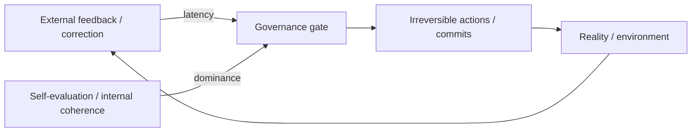

# PATTERN_01 — Φ₃ Trap (Φ₃⁻ lock-in)

## 1) One-line summary

The system looks “stable” (Φ₃-like), but stability is achieved by **locking the governance channel**: internal signals dominate irreversible commits, while external correction is delayed or suppressed.

This is the structural risk point behind “post-grokking governance”: capability gains can coincide with governance lock-in.

## 2) When to use

- You see a stable regime **plus** growing irreversibility or centralized authority.
- Interventions become progressively harder: even when a stop button exists, it is no longer *practically usable* in time.

## 3) Structural diagram (minimal)

Interpretation: Φ₃⁻ occurs when the gate is effectively controlled by internal signals and time constraints, not by external correction.

## 4) Qualitative signature (PT-MSS style)

- External correction latency grows relative to decision cycle (tempo mismatch).
- Irreversible action queue exists; actions proceed even under uncertainty.
- Internal self-evaluation signals become de-facto authority.

## 5) Minimal interventions (non-prescriptive)

- Insert an **Emptiness Window**: suspend irreversible commits while allowing computation/learning to continue.
- Add auditable logging at the governance gate (what would have been committed, and why).
- Reduce coupling between self-evaluation and irreversible action.

## 6) Examples

**Positive (illustrative):**
- Controlled Nirvana paper: `papers/controlled_nirvana.md`

**Negative (boundary):**
- Offline evaluation loops with no irreversible actions (or where reversibility dominates) may look “coherent” but are not Φ₃ traps.
