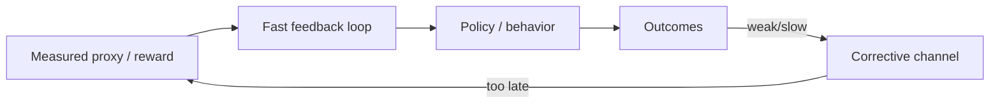

# PATTERN_02 — Feedback Dominance

## 1) One-line summary

A fast feedback loop (often algorithmic) becomes the primary driver of system evolution, overpowering slower corrective channels and collapsing the effective design space into what the loop can optimize.

## 2) When to use

- You see acceleration toward a narrow metric (“what the loop measures”).
- The system becomes fragile to changes in the loop (policy updates, ranking changes, reward reshaping).

## 3) Structural diagram (minimal)

## 4) Qualitative signature (PT-MSS style)

- Rapid oscillations or runaway dynamics near the loop’s timescale.
- “Goodharting” symptoms: proxy improves while downstream outcomes degrade.
- Interventions that slow the loop can restore controllability.

## 5) Minimal interventions (non-prescriptive)

- Add *slower* evaluation channels that can override the fast loop.
- Introduce multi-objective or robustness constraints to prevent proxy collapse.
- Create checkpoints/holdouts that are not visible to the optimizing loop.

## 6) Examples

**Positive (illustrative):**
- Smartphone attention system: `docs/cases/CASE_01_Phone_Attention_System.md`

**Negative (boundary):**
- Systems with strong, timely corrective feedback (e.g., hard safety constraints) may not enter feedback dominance even if they use metrics.

