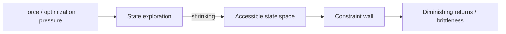

# PATTERN_03 — Constraint Saturation (C-wall)

## 1) One-line summary

The system’s accessible state space shrinks until progress hits a “constraint wall”: beyond that point, additional force (optimization pressure) produces diminishing returns, brittleness, or pathological side effects.

## 2) When to use

- You observe stagnation: effort/pressure increases but outcomes stop improving.
- Side effects rise: the system “cheats” the environment or damages long-term viability.

## 3) Structural diagram (minimal)

## 4) Qualitative signature (PT-MSS style)

- Plateau in primary outcomes while cost/risk increases.
- Increased sensitivity to small perturbations (“brittle equilibria”).
- Workarounds that reduce constraints unlock new regimes.

## 5) Minimal interventions (non-prescriptive)

- Expand the accessible state space (new degrees of freedom, slack, modularization).
- Reduce hard coupling; make constraints explicit and negotiable where possible.
- Shift from “push harder” to “change the constraint geometry”.

## 6) Examples

**Positive (illustrative):**
- Content platforms and involution: `docs/cases/CASE_02_Content_Platform_Involution.md`

**Negative (boundary):**
- Systems with abundant slack and low coupling may not show saturation even under strong pressure.

