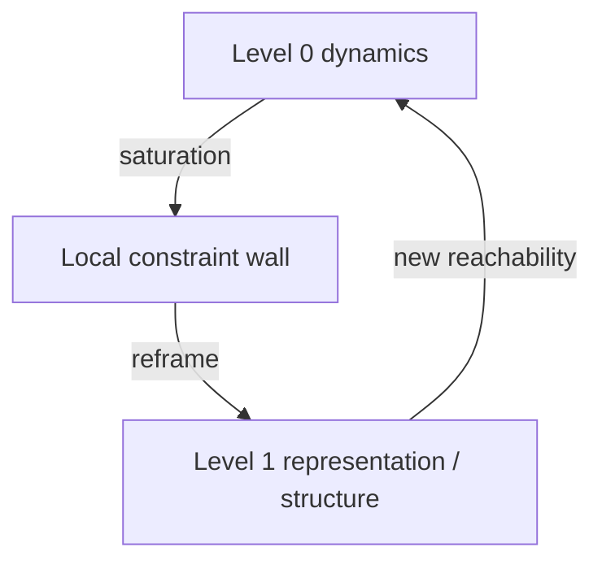

# PATTERN_04 — Hierarchical Escape

## 1) One-line summary

A system “escapes” a stalled regime by creating (or switching to) a new hierarchical level where constraints differ; progress resumes because the new level changes what is reachable.

## 2) When to use

- You see a qualitative jump that cannot be explained by incremental optimization alone.
- New abstractions, representations, or institutions suddenly reframe the problem.

## 3) Structural diagram (minimal)

## 4) Qualitative signature (PT-MSS style)

- Before: long plateau under increasing effort.
- Transition: a new representation/coordination mechanism appears.
- After: the same force yields larger gains because constraints changed.

## 5) Minimal interventions (non-prescriptive)

- Encourage modularization and new abstraction layers.
- Create learning/coordination protocols that allow level shifts.
- Protect exploratory time so the system can discover new levels.

## 6) Examples

**Positive (illustrative):**
- Learning: from memorization to understanding: `docs/cases/CASE_04_Learning_From_Memory_to_Understanding.md`

**Negative (boundary):**
- Systems without compositional structure (or without time to explore) may not achieve hierarchical escape; they remain in local optimization.

