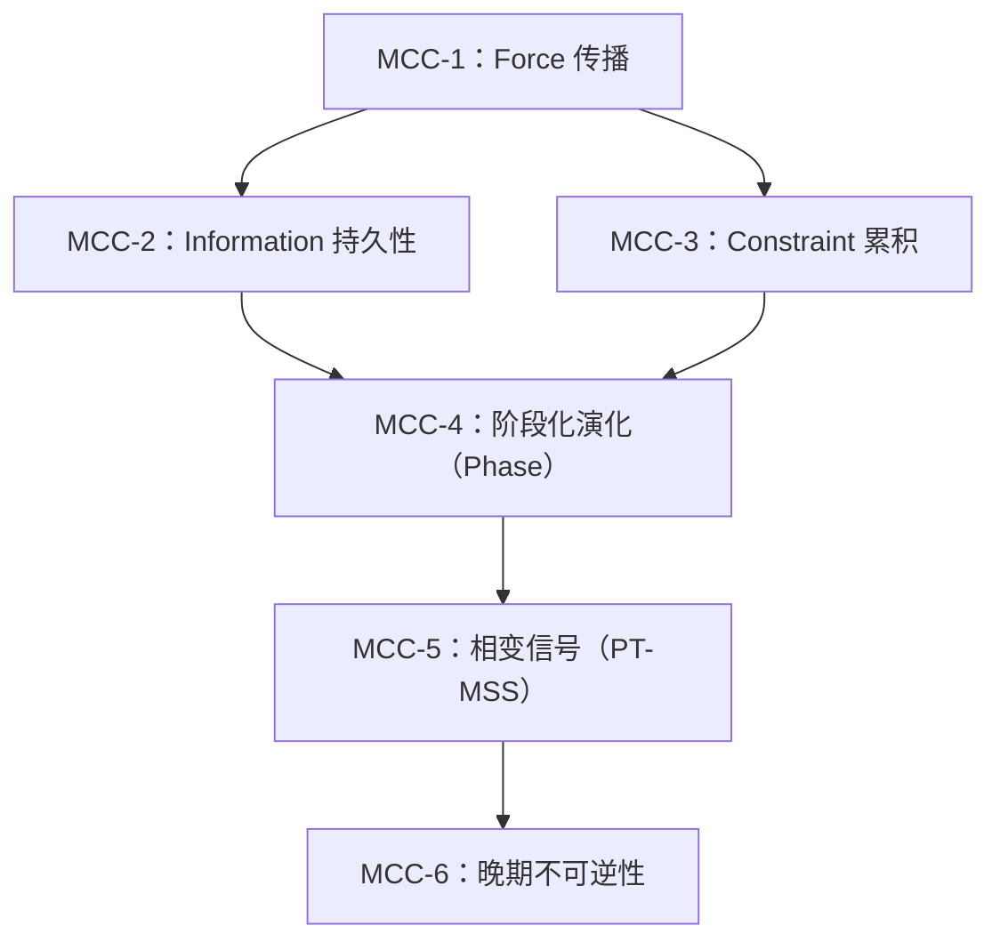

# MCC 依赖图（v2.4.1+）

状态：**核心文档**。把 MCC 的 6 条断言映射为依赖图（DAG），用于展示理论逻辑结构。

导航：[`core 索引`](./README.md) | [`核心卡片`](./fit_core_card.md) | [`MCC`](./MCC.md) | [`重建导言`](./reconstruction_guide.md)

## 目的

本文件把 6 条 MCC 断言映射为依赖图，明确：
- 哪些断言是基础的（无依赖）
- 哪些断言是派生的（依赖于其他断言）
- 从原语到涌现性质的逻辑流向

## MCC 依赖图（DAG）

## 依赖矩阵

| 断言 | 依赖 | 推出 |
|------|------|------|
| MCC-1（Force） | 无 | MCC-2, MCC-3 |
| MCC-2（Information） | MCC-1 | MCC-4 |
| MCC-3（Constraint） | MCC-1 | MCC-4 |
| MCC-4（Phase） | MCC-2, MCC-3 | MCC-5 |
| MCC-5（Transition） | MCC-4 | MCC-6 |
| MCC-6（Irreversibility） | MCC-5 | 终止性质 |

## 解释（非形式）

### Layer 0：基础（MCC-1）

Force 传播是唯一的独立断言：变化需要一个可跨层级/子系统传播的驱动力。

### Layer 1：双后果（MCC-2, MCC-3）

从 Force 出发，产生两条并行后果：
- **Information 持久性**：什么被稳定写入
- **Constraint 累积**：什么被排除/变得不可达

### Layer 2：综合（MCC-4）

Phase 把 Information 与 Constraint 综合起来：不同 Phase 的差异体现在“什么信息能稳定、什么约束在起作用”。

### Layer 3：动力学（MCC-5）

PT-MSS 把 Phase 的转换变成可登记对象（而不是叙事标签）。

### Layer 4：终止性质（MCC-6）

晚期不可逆性是收敛性质：进入协调晚期后，大尺度回退越来越不可能。

## 链接到 EST

每个节点都对应 estimator-scoped 的断言。EST/估计器诊断见 [`docs/est/diagnostics.md`](../../est/diagnostics.md)。
