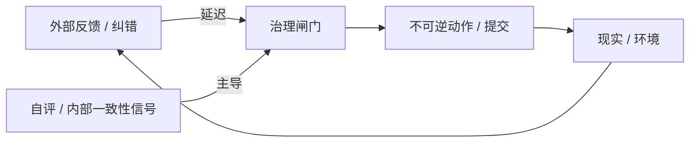

# PATTERN_01 — Φ₃ Trap（Φ₃⁻ 锁死）

## 1) 一句话总结

系统看起来进入了“稳定态”（像 Φ₃），但稳定来自 **治理通道的锁死**：内部信号开始主导不可逆提交，而外部纠错通道被延迟或被压缩到跟不上决策节拍。

## 2) 适用场景

- 你看到“稳定 + 不可逆性上升/权威集中”的组合。
- 干预越来越难：即便存在停止按钮，也变得不再*可及时使用*。

## 3) 结构图（最小）

## 4) 定性签名（PT-MSS 风格）

- 外部纠错延迟相对决策周期上升（tempo mismatch）。
- 不可逆动作队列存在；在不确定性下仍持续提交。
- 内部自评信号成为事实上的“权威来源”。

## 5) 最小干预（非处方）

- 插入 **Emptiness Window**：允许继续计算/学习，但暂停不可逆提交。
- 在治理闸门处加可审计日志（本来要提交什么、为什么）。
- 降低自评信号与不可逆动作的耦合。

## 6) 例子

**正例（示意）：**
- Controlled Nirvana：`papers/controlled_nirvana.md`

**反例（边界）：**
- 纯离线评估、没有不可逆动作链路的系统，即便“很一致”，也不构成 Φ₃ Trap。
