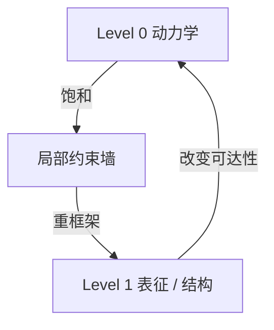

# PATTERN_04 — 层级逃逸（Hierarchical Escape）

## 1) 一句话总结

系统通过创建（或切换到）新的层级，逃离局部停滞：因为新层级改变了约束结构与可达性，所以进展重新出现。

## 2) 适用场景

- 你看到“质变跳跃”，无法用渐进优化解释。
- 新抽象/新表征/新制度突然重构问题空间。

## 3) 结构图（最小）

## 4) 定性签名（PT-MSS 风格）

- 之前：长平台期，压力上升但收效甚微。
- 转折：出现新的表征/协调机制。
- 之后：同样的驱动力产生更大收益（约束变了）。

## 5) 最小干预（非处方）

- 鼓励模块化与新抽象层。
- 引入允许“层级切换”的学习/协作协议。
- 保护探索时间，让系统有机会发现新层级。

## 6) 例子

**正例（示意）：**
- 学习：从记忆到理解：`docs/zh_cn/cases/CASE_04_Learning_From_Memory_to_Understanding.md`

**反例（边界）：**
- 缺乏可组合结构或缺乏探索时间的系统，可能无法层级逃逸，只能停留在局部优化。

