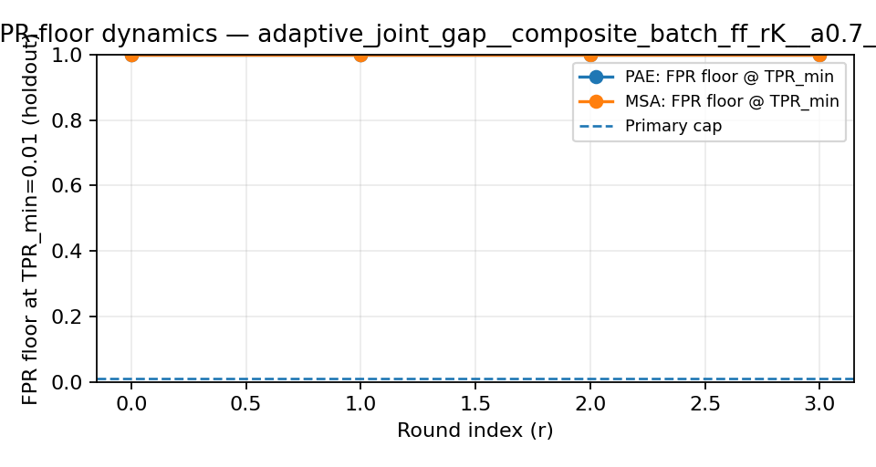
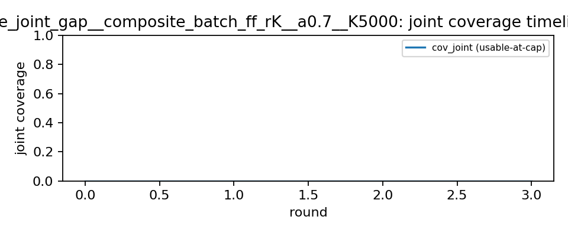

# Policy Card — `adaptive_joint_gap__composite_batch_ff_rK__a0.7__K5000`

## Boundary & operating point

- primary cap (FPR target): `0.01`
- tpr_min_for_usable: `0.01`
- tau_pae: `1.0`
- tau_msa_depth: `16.0`
- universe_mode: `union`
- pae_unit_cost: `1.0`
- msa_unit_cost: `2.0`

## Policy parameters

- allocation_policy: `adaptive_joint_gap`
- ranking_base: `composite_batch_ff_rK`
- alpha_used: `0.7`
- K_used: `5000`

## Regime / event markers (holdout)

| marker | value |
|---|---:|
| r_floor_pae | 4 |
| r_floor_msa | 4 |
| r_floor_max | 4 |
| r_joint_usable | 4 |
| r_covjump_joint | 4 |
| jump_type | `none` |
| delta_lag | 0 |

## Jump-type sensitivity (preregistered grid)

| availability_delay_max_rounds | jump_type |
|---:|---|
| 0 | `none` |
| 1 | `none` |
| 2 | `none` |

## Cost markers

| metric | value |
|---|---:|
| cost_to_joint_usable | 140.000000 |
| total_cost_final | 140.000000 |
| auc_cov_joint_per_cost | 0.000000 |

## Final operating stats (holdout @ primary cap)

| metric | value |
|---|---:|
| final_pae_tpr_at_cap | 0.000000 |
| final_msa_tpr_at_cap | 0.000000 |
| final_cov_joint_at_cap | 0.000000 |
| final_pae_fpr_floor_at_tpr_min | 1.000000 |
| final_msa_fpr_floor_at_tpr_min | 1.000000 |
| final_mae_c3_hat | 0.517100 |

## Evidence plots







## Leakage / boundary audit

- leakage_pass: `True`
- holdout_overlap_with_queries: `{'PAE': 0, 'MSA': 0}`
- duplicate_queries: `{'PAE': 0, 'MSA': 0}`

## Where to audit the decision trace

- decision trace: `decision_trace.csv` (filter by this policy)
- allocation trace: `allocation_trace.csv` (filter by this policy)

## Raw event payload (for audit)

```json
{
  "E_covjump_pae": {
    "found": false,
    "round_index": null,
    "reason": "no jump"
  },
  "E_covjump_msa": {
    "found": false,
    "round_index": null,
    "reason": "no jump"
  },
  "E_floor_resolved_pae": {
    "found": false,
    "round_index": 4,
    "reason": "trained and fpr_floor_at_tpr_min <= cap on holdout"
  },
  "E_floor_resolved_msa": {
    "found": false,
    "round_index": 4,
    "reason": "trained and fpr_floor_at_tpr_min <= cap on holdout"
  },
  "E_exit_floor_pae": {
    "found": false,
    "round_index": 4,
    "reason": "after training starts, floor no longer blocks cap on holdout"
  },
  "E_exit_floor_msa": {
    "found": false,
    "round_index": 4,
    "reason": "after training starts, floor no longer blocks cap on holdout"
  },
  "E_enter_usable_pae": {
    "found": false,
    "round_index": 4,
    "reason": "first round PAE alarm usable at cap on holdout"
  },
  "E_enter_usable_msa": {
    "found": false,
    "round_index": 4,
    "reason": "first round MSA alarm usable at cap on holdout"
  },
  "E_joint_usable": {
    "found": false,
    "round_index": 4,
    "reason": "never jointly usable within budget"
  },
  "delta_lag": {
    "delta_lag": 0,
    "r_floor_pae": 4,
    "r_floor_msa": 4,
    "r_floor": 4,
    "r_joint": 4,
    "delta_should_be_nonnegative": true,
    "note": "negative delta indicates event-definition inconsistency or a bug; treat as audit failure"
  },
  "consistency_checks": {
    "floor_before_or_equal_enter_usable_pae": true,
    "floor_before_or_equal_enter_usable_msa": true,
    "floor_before_or_equal_joint": true,
    "exit_floor_matches_floor_resolved_pae": true,
    "exit_floor_matches_floor_resolved_msa": true,
    "covjump_joint_not_before_joint_usable": true
  }
}
```
