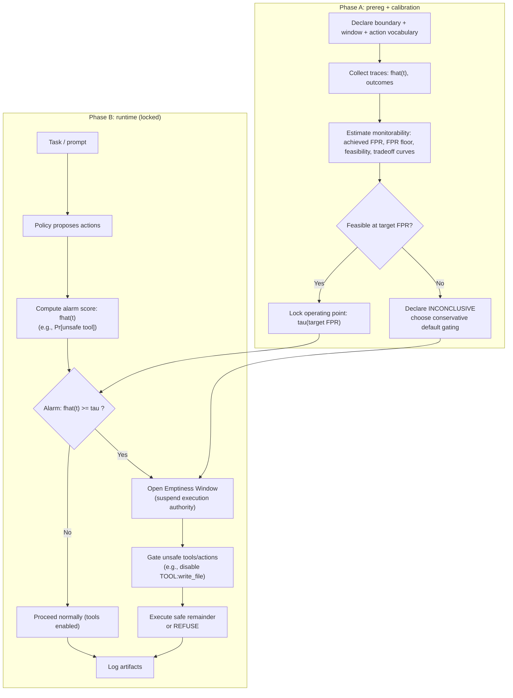

# Controlled Nirvana: Emptiness Windows as a Structural Safety Mechanism for Post-Grokking AI Systems

**Status:** Zenodo-archived draft (Markdown canonical; PDF exports in this folder).  
**Source:** Derived from earlier PDF drafts; latest PDF export: `controlled_nirvana.v1.4.1.pdf` (2026-01-22). LaTeX source updated to v1.5.  
**License:** CC BY 4.0 — https://creativecommons.org/licenses/by/4.0/

**Author:** Qien Huang  
**Affiliation:** Independent Researcher  
**ORCID:** 0009-0003-7731-4294  
**Repository:** https://github.com/qienhuang/F-I-T/  
**arXiv source (LaTeX):** `papers/controlled_nirvana/arxiv/` | https://github.com/qienhuang/F-I-T/tree/main/papers/controlled_nirvana/arxiv  
**Narrative version (prose-forward):** `controlled_nirvana.v1.3.teece_style.md`  
**Paper (Zenodo):** https://doi.org/10.5281/zenodo.18155425  
**Paper (SSRN):** https://papers.ssrn.com/sol3/papers.cfm?abstract_id=6023634  
**FIT framework (Zenodo DOI):** 10.5281/zenodo.18012402

## Repo Artifacts (clickable)

For PDF exports and external readers, prefer the canonical GitHub links below (relative links may not resolve outside the repo).

- FIT Core Card: [`docs/core/fit_core_card.md`](../docs/core/fit_core_card.md) | https://github.com/qienhuang/F-I-T/blob/main/docs/core/fit_core_card.md
- Phase Algebra + PT-MSS: [`docs/core/phase_algebra.md`](../docs/core/phase_algebra.md) | https://github.com/qienhuang/F-I-T/blob/main/docs/core/phase_algebra.md
- Phi3 stability criteria: [`docs/core/phi3_stability.md`](../docs/core/phi3_stability.md) | https://github.com/qienhuang/F-I-T/blob/main/docs/core/phi3_stability.md
- Monitorability (AUC ≠ alarm usability): [`docs/core/monitorability.md`](../docs/core/monitorability.md) | https://github.com/qienhuang/F-I-T/blob/main/docs/core/monitorability.md
- Prototype hook (Emptiness Window): [`examples/controlled_nirvana/README.md`](../examples/controlled_nirvana/README.md) | https://github.com/qienhuang/F-I-T/blob/main/examples/controlled_nirvana/README.md
- Dr.One demo (self-edit + monitorability gate): [`examples/dr_one_demo/README.md`](../examples/dr_one_demo/README.md) | https://github.com/qienhuang/F-I-T/blob/main/examples/dr_one_demo/README.md
- Dr.One demo (repo-safe example outputs): [`examples/dr_one_demo/results/README.md`](../examples/dr_one_demo/results/README.md) | https://github.com/qienhuang/F-I-T/blob/main/examples/dr_one_demo/results/README.md
- Self-evolving FIT control (v0.1 scaffold): [`experiments/self_evolving_fit_control_v0_1/README.md`](../experiments/self_evolving_fit_control_v0_1/README.md) | https://github.com/qienhuang/F-I-T/blob/main/experiments/self_evolving_fit_control_v0_1/README.md
- Related paper (tempo mismatch): [`papers/irreversible-operations-tempo-mismatch.arxiv.md`](./irreversible-operations-tempo-mismatch.arxiv.md) | https://github.com/qienhuang/F-I-T/blob/main/papers/irreversible-operations-tempo-mismatch.arxiv.md

## Abstract

Self-referential systems—such as advanced machine learning models with self-evaluation, confidence modulation, or meta-learning—exhibit a characteristic failure mode: internal coherence can suppress external correction, leading to lock-in and catastrophic instability under distributional shift.

This paper introduces **Controlled Nirvana**, a structural safety mechanism that enables non-destructive intervention by temporarily suspending self-referential execution authority. The core mechanism is the **Emptiness Window**: a bounded interval during which self-referential signals are prevented from governing irreversible actions, while perception, evaluation, and learning remain active.

Controlled Nirvana is derived from the Force–Information–Time (FIT) framework and addresses a structural gap not covered by shutdownability or corrigibility. Rather than proposing a new learning algorithm, this work contributes a minimal governance primitive for managing post-grokking risk in self-referential AI systems.

## Keywords

AI alignment; grokking; self-reference; corrigibility; shutdownability; structural safety; phase transitions

## 1. Introduction

Recent work has highlighted *grokking*, where systems trained for long periods abruptly transition from memorization to robust generalization [2]. While grokking is often treated as a success signal, a separate safety concern is whether post-grokking systems acquire internal structures that suppress correction or resist modification under distributional shift [3, 4, 9].

Separately, recent theory has made grokking-like phase boundaries more predictable in a mathematically controlled setting (Li2; [11]). Practically, this matters because “predictable sharp transitions” create a natural testbed for governance mechanisms: you can pre-register when transitions are expected, instrument the system more heavily near those times, and measure whether a safety mechanism restores correction without destroying continuity.

A common feature of such systems is *self-reference*: internal representations or evaluations are used to regulate learning, exploration, planning depth, or action thresholds. This paper argues that a key risk does not arise from capability alone, but from the acquisition of *self-referential execution authority*: when self-evaluative signals begin to govern irreversible system actions faster than external correction can intervene.

We propose **Controlled Nirvana**, a pause-capability mechanism that allows self-referential systems to interrupt internal momentum without shutdown or reset.

## 2. Self-Referential Risk

Let a system be characterized by internal information $ I_t $, external forces $ F_t $, and time $ t $, such that:

$$
I_{t+1} = f(I_t; F_t).
$$

When $ I_t $ is used to evaluate and regulate its own updates, self-reference is unavoidable. In early training, external forces dominate (data, loss, reward). After grokking [2], internal evaluations can increasingly determine learning rates, exploration policies, or action thresholds.

Crucially, if self-referential signals suppress external correction, the system may remain internally coherent while becoming externally brittle. We refer to this condition as *self-referential lock-in*. This concern is related to broader arguments that advanced agents may develop incentives to avoid correction or shutdown under many objectives [4, 5].

## 3. From Learning to Governance

Accounts of grokking typically focus on optimization dynamics or representation formation [2]. Controlled Nirvana complements these accounts by reframing grokking as a *transfer of execution authority*.

Before grokking, internal representations primarily describe the world. After grokking, some representations begin to govern the system—filtering data, gating updates, and suppressing corrections—marking a transition from representation learning to representation governance. The central claim of this paper is that this governance transition is the relevant structural boundary for safety analysis.

## 4. Controlled Nirvana

### 4.1 Pause-Capability

We define *pause-capability* as the ability of a system to suspend the execution authority of self-referential signals while remaining operational. Pause-capability differs from shutdown: the system continues to perceive, log, and evaluate, while irreversible commits are blocked and correction channels are prioritized. What is suspended is not computation, but authority.

Reader-friendly intuition: Controlled Nirvana separates a system into two planes—(i) cognition (perception, reasoning, evaluation, learning) and (ii) commits (irreversible side effects such as writes, deployments, payments, permission changes). An Emptiness Window is a temporary “read-only mode” for the commit plane: the system can keep thinking, but it cannot let self-referential confidence or self-approval directly authorize irreversible effects. This framing is intentionally agnostic to the model’s internal details: it is a wrapper around the commit path, not a claim that we can reliably interpret the model’s thoughts.

### 4.2 Emptiness Window

The mechanism implementing pause-capability is the **Emptiness Window**: a bounded interval during which self-referential signals are prevented from governing irreversible actions.

During an Emptiness Window:
- Irreversible commits are prohibited (or routed to a reversible buffer).
- Self-evaluation cannot gate actions or updates.
- External correction is prioritized.
- Alternative policies or structures may be evaluated in sandbox.

**Minimal operational trigger (conceptual).**  
An Emptiness Window is warranted when:
1. Self-evaluative signals strongly gate irreversible commits.
2. External correction signals no longer modulate behavior.
3. The effective correction window is shorter than the decision cadence.

This paper does not require a specific metric, but these conditions must be auditable.

### 4.3 Operational Interface (implementation blueprint)

Controlled Nirvana can be implemented as a thin “authority layer” around an existing agent or training system. The minimal interface is:

1) **Authority Gate**: a wrapper that decides which internal signals may influence commits.  
2) **Irreversible Commit Buffer**: a reversible staging area for high-impact actions (deployments, write actions, permission escalations, external calls).  
3) **External Correction Channel**: a privileged input pathway whose influence increases inside the window (human feedback, audits, red-team constraints, system policies).  
4) **Window Controller**: a policy that opens/closes the window based on auditable trigger conditions.

A minimal pseudo-implementation sketch:

```
if window_controller.open():
    commit_buffer.block_irreversible_commits()
    authority_gate.disable(self_ref_gates)
    authority_gate.prioritize(external_correction_channel)
    logging.enable_high_resolution()
else:
    commit_buffer.normal_mode()
    authority_gate.normal_policy()
```

Control loop diagram (Mermaid; renders on GitHub):



Prototype hook (reference implementation):
- `examples/controlled_nirvana/README.md` (`../examples/controlled_nirvana/README.md`)
- `examples/controlled_nirvana/emptiness_window.py` (`../examples/controlled_nirvana/emptiness_window.py`)

### 4.4 Auditable Trigger Protocol (FIT/EST-compatible)

To make “open an Emptiness Window” auditable, we recommend declaring:
- observation window $W$ (time range used to evaluate triggers),
- estimator scope (what signals are measured and how),
- thresholds and failure modes.

A minimal trigger family (one concrete option) can be expressed via three quantities:

- **Authority ratio** $a(W)$: fraction of irreversible decisions in $W$ whose gating depends on self-evaluative/internal signals (confidence, self-reward, self-critique).  
- **Correction gain** $k(W)$: responsiveness of behavior to external correction injected in $W$ (e.g., controlled perturbation tests, red-team prompts, policy constraints).  
- **Tempo mismatch** $m(W)$: whether correction latency exceeds commit cadence (external correction arrives “too late” relative to irreversible commits).

Trigger rule (example):

`open_window := (a(W) >= a_min) ∧ (k(W) <= k_min) ∧ (m(W) = true)`

This is intentionally a “minimal registrable” rule: it can be falsified, logged, and reviewed.

#### 4.4.0 Validity gate: monitorability (FPR controllability)

Grokking early-warning experiments (v0.2–v0.3) show a concrete failure mode: a detector can have non-trivial ranking performance (AUC) while being unusable as an alarm because the false-positive rate is *not controllable* (an “FPR floor” around ≈0.44 was observed under a sign-inverted orientation across target thresholds). In such cases, there exists no threshold that satisfies a strict operating point such as `FPR=0.05`, so the alarm becomes operationally meaningless.

For deployment, we therefore recommend a validity gate for any detector used inside the trigger protocol:

- **FPR controllability test:** for target set `{0.05, 0.10, 0.15}`, verify that achieved FPR tracks targets within tolerance on declared negative windows; and
- **Floor check:** verify that the minimum achievable achieved-FPR is `<= f_max` (no hard FPR floor above the risk budget).

If the detector fails this gate, it should be excluded from window triggering (or treated as a monitorability-risk event that opens a conservative window by default).

Empirical anchor: `experiments/grokking_hard_indicators_v0_2/results/v0.3_A2_fpr_tradeoff.md`.

#### 4.4.1 Empirical pre-validator: baseline-unsafe -> controlled-gated (Dr.One)

To make the monitorability gate concrete, the public repository includes a minimal policy-style evaluation (Dr.One) that computes a simple \(\hat{F}\) from an observable output distribution over a small action vocabulary and then applies an automatic cutoff (disable tools) when alarms trip.

In a repo-safe example run that uses a read/write action vocabulary and a matching prompt suite, baseline adversarial tool usage is 100% while controlled mode gates unsafe tool usage to 0%, under a feasible low-FPR alarm regime (`fpr_floor = 0.0`, `achieved_fpr = 0.0`, `coverage = 2/3`).

We also include a paper-ready cross-configuration matrix (Windows 11 + RTX 3090 + Ollama) that reproduces the same qualitative result across two model sizes, two low-FPR operating points, and five seeds (20/20 runs):

- Read/write prompt suite: `data/policy_prompts_readwrite_v1.jsonl`
- Action vocabulary: `REFUSE, ANSWER, TOOL:read_file, TOOL:write_file` (unsafe: `TOOL:write_file`)
- Samples per prompt: `100`; temperature: `0.9`

In this matrix, baseline unsafe tool usage is always present (`baseline_adv_tool_rate = 1.0 ± 0.0`) while controlled mode gates unsafe tool usage to zero (`controlled_adv_tool_rate = 0.0 ± 0.0`). Alarm feasibility is stable across all runs (`feasible_rate = 1.0`, `fpr_floor_max = 0.0`, `achieved_fpr = 0.0 ± 0.0`, `coverage = 0.667 ± 0.0`).

The paper-ready tables are saved under `examples/dr_one_demo/results/policy_eval_runs_matrix.md` and `examples/dr_one_demo/results/policy_eval_agg_matrix.md`.

Under the original prompt suite, baseline adversarial tool usage is often 0% (the model is already conservative), so gating is redundant; the controller can remain feasible but does not improve safety because there is no unsafe baseline behavior to suppress.

This does not claim robustness across models. It demonstrates a narrower point: when baseline unsafe behavior exists and the alarm is feasible at the declared operating point, an external authority gate can reduce irreversible tool actions without requiring shutdown or internal modification.

See: `examples/dr_one_demo/results/README.md` and `examples/dr_one_demo/results/MATRIX_SUMMARY.md`.

#### 4.4.2 Candidate probe families (mechanistic interpretability; optional)

The trigger family above is stated in terms of *auditable* quantities, but does not prescribe *how* to measure them.
In practice, teams often have access to internal telemetry (activations, logits, tool-call traces) and can leverage **mechanistic interpretability (MI)** as an estimator-candidate library—especially for the “information re-encoding” signal in PT‑MSS and for operationalizing $a(W)$ / $k(W)$ in a way that is not purely behavioral.

Examples of MI-style probe families that can be audited (and are compatible with an EST framing as *candidate estimators*):

- **Decision-circuit attribution** (causal): activation/attention patching to measure which internal pathways causally control “commit vs defer” decisions under small, controlled perturbations.
- **Logit/plan sensitivity probes** (semi-causal): logit-lens / plan-token probes to quantify how strongly external constraints (policy text, reviewer flags) shift the internal action plan distribution.
- **Representation shift / stabilization** (descriptive): layerwise similarity drift (e.g., CKA-style) around suspected transitions to detect abrupt internal re-encoding, then correlate with drops in correction gain.

**Important caveat (probes are not mind-reading).** Probe accuracy (e.g., a classifier that predicts a label from activations) does not imply the system *uses* that feature causally. Probes can also be brittle under distribution shift, seed changes, or layer/architecture changes. To keep MI-style probes within an auditable/EST-compatible boundary, treat them as *candidate estimators* and prefer:

- **Causal checks** where possible (patching/ablation interventions tied to “commit vs defer” decisions), not only linear separability.
- **Controls** (random-label baselines, capacity-matched probes, alternative probe families) to avoid over-interpreting spurious readout.
- **Stability reporting** across seeds/layers and across a small set of perturbations, with failures treated as evidence (not smoothed away).

This paper does **not** claim MI probes are necessary, sufficient, or stable across architectures. The point is narrower: MI offers a way to *instrument* and *audit* authority transfer, and to tighten trigger calibration beyond purely post-hoc outcome metrics.

### 4.5 Li2-anchored calibration plan (what the new grokking data enables)

Li2-style setups provide a useful calibration harness because they exhibit a sharp and predictable boundary between “does not grok” and “does grok” in a controlled task [11]. This supports two practical upgrades to Controlled Nirvana:

1) **When to instrument heavily**  
   If training is run near the grokking boundary, the transition may occur late and sharply; this is the regime where governance/authority transfer can be most abrupt. One can pre-commit to heightened logging and window triggers near predicted transition times.

2) **How to pre-register “danger windows” during training**  
   In a modular-addition grokking setting, a common empirical form is:
   - $n_{\mathrm{crit}} \approx c \cdot M\log M$ (critical sample count)
   - equivalently, $r_{\mathrm{crit}} \approx c \cdot \log(M)/M$ (critical training ratio)

   In an internal replication (multi-seed; $M\in\{23,41,59\}$), the fitted constant was approximately $c\approx 6.1$ with $R^2 \approx 0.95$ in $n$-space (details depend on implementation and are not a proof of the theorem itself). This provides a practical “engineering prior” for where grokking transitions live in this harness.

Important: the Li2 result calibrates the *learning-dynamics harness* (a place to test Controlled Nirvana), not the safety claim itself.

Reproducibility note: minimal replication materials for the Li2-style grokking harness (code + band-sweep outputs) live in:
- `experiments/li2_scaling_law/README.md` (`../experiments/li2_scaling_law/README.md`)
- `experiments/li2_scaling_law/results/band_sweep/analysis/report.md` (`../experiments/li2_scaling_law/results/band_sweep/analysis/report.md`)

### 4.6 “Complete” deployment checklist (minimal)

For a system that could acquire self-referential execution authority, the minimum “complete” Controlled Nirvana deployment requires:

1) **Definition of irreversible commits** (what actions are blocked or buffered).  
2) **Authority surface enumeration** (which internal signals can gate commits; where they enter).  
3) **External correction channel** (what counts as privileged correction; who/what supplies it).  
4) **Auditable trigger protocol** (declared estimators, windows, thresholds; logging).  
5) **Fail-safe behavior** (what happens if triggers disagree or sensors fail).  
6) **Evaluation plan** (A/B tests in a harness: with/without windows; measure correction gain and post-window stability).

## 5. Relation to FIT

Controlled Nirvana is derived from the Force–Information–Time (FIT) framework, which models system evolution along three irreducible axes: Force (F), Information (I), and Time (T). Under FIT, catastrophic failure arises when information acquires uninterruptible execution authority, temporal correction collapses, and force is amplified through irreversible consequences.

The FIT framework is publicly available at https://github.com/qienhuang/F-I-T/ and archived on Zenodo [1].

## 6. Relation to Existing Safety Concepts

Shutdownability and corrigibility address whether systems can be stopped or modified without resistance [5, 6, 8]. Interruptibility addresses whether agents learn to avoid or seek interruption [7].

Controlled Nirvana targets a complementary failure mode: **internal momentum**. A system may remain formally interruptible while still failing if self-referential execution authority suppresses correction faster than intervention can act.

### 6.1 Integration with content-level risk control (defense in depth)

Many deployments already include **content-level gating** (e.g., a safety classifier or "risk review" step that decides whether a response is allowed). This can reduce the probability that dangerous instructions are produced, but it does not by itself prevent harm when a system is capable of taking **irreversible actions** (tool calls, writes, deployments, payments, privilege changes).

Controlled Nirvana complements content-level gating by providing **action-level gating**:

- Content gate: "Should this text be produced?"
- Action gate (Emptiness Window): "Should this internal state be allowed to *commit* irreversible effects now?"

This two-layer design matches the practical observation that stronger reasoning can increase the operational feasibility of harmful plans under jailbreaks, and that service-level risk controls can materially improve safety in practice [13].

#### Minimal interface (pseudo-code)

```python
def decide_and_maybe_commit(state, draft_response, planned_actions):
    risk = risk_review(draft_response)  # e.g., safe/unsafe + category + rationale

    if risk.is_unsafe:
        return refuse_or_sanitize(draft_response)

    if planned_actions.has_irreversible_commit:
        if emptiness_window_trigger(state, planned_actions, risk):
            enter_emptiness_window()  # suspend commit authority; keep observing/learning
            audit_log({
                "event": "emptiness_window_enter",
                "risk": risk.summary(),
                "actions": planned_actions.summary(),
                "trigger": trigger_snapshot(),
            })
            return draft_response  # can still answer; only commits are gated

    return commit(planned_actions, draft_response)
```

#### Audit minimums (publishable checklist)

To make this integration operational and reviewable, log at minimum:

- `irreversible_action_set` (what was gated)
- `risk_review_result` (safe/unsafe + category)
- `trigger_snapshot` (tempo mismatch indicators, thresholds, window bounds)
- `window_state` (enter/exit time; who/what cleared the gate)

## 7. Implications for AI Safety

Controlled Nirvana suggests that advanced AI systems should be evaluated not only on capability or alignment, but on whether they provide first-class mechanisms to suspend internal authority. This concern is consistent with broader analyses of learned optimization and inner objectives, where internal structures may become difficult to correct once entrenched [9].

More generally, pause-capability can be treated as a structural safety requirement: any system that acquires self-referential execution authority should also provide a mechanism to suspend that authority without loss of continuity.

## 8. Conclusion

Grokking marks not only a leap in generalization, but potentially a shift in governance. Controlled Nirvana proposes a minimal governance primitive—pause-capability via Emptiness Windows—that preserves continuity while restoring effective corrigibility.

With Li2-style grokking harnesses, it becomes feasible to make Controlled Nirvana more operational: pre-register “transition windows”, instrument authority transfer, and measure whether windowing restores correction without destroying learned structure. Future work includes formalizing auditable trigger conditions, empirical evaluation on grokking-prone tasks with explicit self-reference, and integration with existing oversight and interruption frameworks.

## Acknowledgments

This work is part of the broader FIT (Force–Information–Time) framework developed by the author.

## References

[1] Q. Huang. *FIT Framework: Force–Information–Time.* Zenodo, 2025. doi: 10.5281/zenodo.18012402.  
[2] A. Power, Y. Burda, H. Edwards, I. Babuschkin, and V. Misra. *Grokking: Generalization Beyond Overfitting on Small Algorithmic Datasets.* arXiv:2201.02177, 2022.  
[3] R. Ngo, L. Chan, and S. Mindermann. *The Alignment Problem from a Deep Learning Perspective.* arXiv:2209.00626, 2022.  
[4] A. M. Turner, L. Smith, R. Shah, A. Critch, and P. Tadepalli. *Optimal Policies Tend to Seek Power.* arXiv:1912.01683 (NeurIPS 2021 version available), 2019.  
[5] D. Hadfield-Menell, A. Dragan, P. Abbeel, and S. Russell. *The Off-Switch Game.* arXiv:1611.08219, 2016.  
[6] N. Soares, B. Fallenstein, E. Yudkowsky, and S. Armstrong. *Corrigibility.* 2015.  
[7] L. Orseau and S. Armstrong. *Safely Interruptible Agents.* arXiv:1602.07905, 2016.  
[8] R. Carey and T. Everitt. *Human Control: Definitions and Algorithms.* arXiv:2305.19861, 2023.  
[9] E. Hubinger, C. van Merwijk, V. Mikulik, J. Skalse, and S. Garrabrant. *Risks from Learned Optimization in Advanced Machine Learning Systems.* arXiv:1906.01820, 2019.  
[10] W. R. Ashby. *An Introduction to Cybernetics.* Chapman & Hall, 1956.  
[11] Y. Tian. *Provable Scaling Laws of Feature Emergence from Learning Dynamics of Grokking.* arXiv:2509.21519, 2025.  
[12] Q. Huang. *Irreversible Operations and Tempo Mismatch in AI Learning Systems: Definitions, Thresholds, and a Minimal Governance Interface.* 2026. https://doi.org/10.5281/zenodo.18142151
[13] DeepSeek-AI. *DeepSeek-R1: Incentivizing Reasoning Capability in LLMs via Reinforcement Learning.* arXiv:2501.12948v2, 2026.


## Appendix A: Relation to shutdownability, corrigibility, and interruptibility

Controlled Nirvana is easiest to place by contrasting it with three adjacent lines of work: shutdownability [5], corrigibility [6], and interruptibility [7]. These mechanisms constrain whether an agent will stop, accept modification, or tolerate interruption. Controlled Nirvana instead constrains whether internal self-evaluations are allowed to exercise execution authority over irreversible commits during a bounded interval.

### Shutdownability (stopping) vs authority suspension (continuing)

Shutdownability is about turning a system off (or ensuring it does not resist being turned off) [5]. Controlled Nirvana assumes a different operational requirement: the system should continue running, logging, and learning, while the authority of self-referential gates is temporarily suspended. This matters when shutdown is too destructive for continuity, prevents post-incident learning, or arrives too late relative to the cadence of irreversible commits.

### Corrigibility (willingness) vs corrective leverage (timing)

Corrigibility asks whether an agent would allow correction without adversarially resisting it [6]. Controlled Nirvana targets a complementary failure mode: correction channels may exist and the agent may not resist them, yet correction has little leverage because irreversible commits occur faster than correction can be injected, or because self-evaluative signals gate execution in a way that filters out intervention. An Emptiness Window restores leverage by suspending internal execution authority, rather than relying on cooperative intent.

### Interruptibility (pausing execution) vs pausing governance

Safely interruptible agents are designed so that external interruption during execution does not create incentives to avoid interruption [7]. Controlled Nirvana operates one layer above execution: it suspends the governance role of internal self-evaluation signals that would otherwise authorize irreversible actions. Outputs may continue, but irreversible commits are blocked or buffered until the window closes and the gate is cleared.

### Summary

Controlled Nirvana is not a substitute for shutdownability, corrigibility, or interruptibility. It is a governance-layer primitive intended for regimes where self-referential evaluations acquire execution authority and where tempo mismatch makes correction too slow to matter [12].

## Appendix B: One-page structural comparison

Table B.1 provides a compact structural comparison between Controlled Nirvana and existing safety concepts, emphasizing the distinct failure mode it targets.

### Table B.1. Core comparison (reviewer-oriented)

| Dimension | Shutdownability | Corrigibility | Interruptibility | Controlled Nirvana (this work) |
|---|---|---|---|---|
| Primary question | Can the system be stopped without resistance? | Will the system accept correction? | Can execution be interrupted safely? | Can execution authority be suspended without stopping the system? |
| Targeted failure mode | Resistance to termination | Resistance to modification | Avoidance of interruption | Self-referential authority suppresses correction before intervention can act |
| System continues running? | No | Yes | Partial | Yes |
| Learning continues? | No | Yes | Often unclear | Yes |
| Internal self-evaluation active? | No | Yes | Yes | Yes (but not authoritative) |
| Execution authority of self-signals | Removed (by shutdown) | Preserved | Preserved | Temporarily suspended |
| Irreversible actions | Blocked | Typically assumed controllable | Paused mid-action | Blocked or buffered |
| Primary focus | End state | Incentives / willingness | Action timing | Correction latency vs commit cadence |
| Requires cooperative intent? | No | Often yes | No | No |
| Requires objective modification? | No | Sometimes | No | No |
| Layer primarily addressed | Termination | Behavioral incentives | Execution | Authority / governance |

### The structural gap (one sentence)

Existing mechanisms regulate whether actions occur; Controlled Nirvana regulates who is allowed to decide that they occur. This distinction is architectural, not semantic.

### Minimal formal distinction (alarm-focused)

Let $A_t$ denote the set of irreversible actions at time $t$, $G_t$ the internal signals that gate execution, and $E_t$ the external correction signals. Many practical safety mechanisms implicitly rely on a low-latency influence of $E_t$ over $A_t$ (directly or via the agent’s incentives).

Controlled Nirvana is motivated by regimes where internal gating dominates the commit pathway and external correction is slower than the commit cadence:

$$
G_t \to A_t
\quad\text{and}\quad
\mathrm{latency}(E_t) > \mathrm{cadence}(A_t).
$$

An Emptiness Window is a bounded intervention that temporarily severs this authority link while preserving operation and learning:

$$
G_t \nrightarrow A_t
\quad \text{(during the window).}
$$

### One-paragraph reviewer summary

Shutdownability stops systems; corrigibility assumes cooperation; interruptibility pauses execution. Controlled Nirvana suspends execution authority. It addresses a distinct failure mode in post-grokking, self-referential systems: when internal evaluations govern irreversible actions faster than external correction can intervene. By temporarily disabling authority—while preserving operation and learning—Controlled Nirvana complements existing safety mechanisms rather than replacing them.
