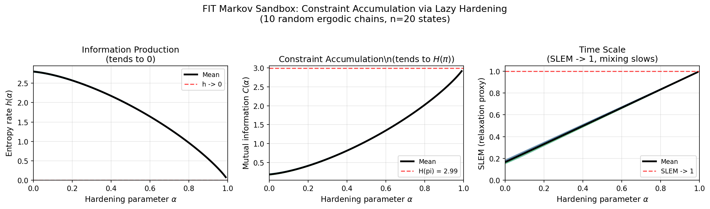

# FIT Markov Sandbox

**A Provable Specialization of the FIT Framework**

This directory contains the first mathematically rigorous anchor for the F-I-T (Force-Information-Time) framework, demonstrating constraint accumulation in finite-state Markov chains.

---

## Key Result

Using a lazy hardening path $P_\alpha = (1-\alpha)P + \alpha I$, we prove that as $\alpha \to 1$:

| Quantity | Behavior | Interpretation |
|----------|----------|----------------|
| Entropy rate $h(\alpha)$ | $\to 0$ | Information production ceases |
| Constraint $C(\alpha)$ | $\to H(\pi)$ | Maximal temporal dependence |
| Mixing time $T(\alpha)$ | $\to \infty$ | System becomes frozen |

This defines a **Markov-specialized nirvana state**: a fully constrained, frozen dynamical regime.

---

## Numerical Validation



**Results across 10 random ergodic chains (n=20 states):**
- Entropy rate h(alpha): 97.3% reduction as alpha -> 1
- Constraint C(alpha): 15.5x increase, approaching H(pi)
- SLEM (relaxation proxy): approaches 1, indicating diverging mixing time

---

## Files

| File | Description |
|------|-------------|
| `fit_markov_sandbox.md` | Full paper with detailed proofs |
| `fit_markov_sandbox_short.md` | Concise version for quick review (canonical short paper) |
| `definitions.md` | Formal definitions and assumptions |
| `experiments.py` | Core numerical validation code |
| `plot_validation.py` | Generates visualization plots |
| `analysis.py` | Extended analysis tools (for grokking experiments) |
| `NOTE_TO_FUTURE_READERS.md` | Methodological guidance |

---

## Quick Start

```bash
# Run basic validation
python experiments.py

# Generate plots
python plot_validation.py
```

**Requirements:** NumPy, Matplotlib

---

## Key Theorems

### Proposition 1 (Stationary Invariance)
For the lazy hardening family, $\pi_\alpha = \pi$ for all $\alpha \in [0,1)$.

### Lemma 1 (Row Entropy Suppression)
Under self-dominance ($P(i,i) \geq P(i,j)$ for all $j$), row entropies are non-increasing in $\alpha$.

### Theorem 1 (Nirvana Limit)
As $\alpha \to 1$: $h(\alpha) \to 0$, $C(\alpha) \to H(\pi)$, $T(\alpha) \to \infty$.

---

## Scope and Limitations

This work **does not claim** that:
- FIT universally reduces to Markov dynamics
- All systems admit a lazy hardening path
- Nirvana is desirable or optimal

It **does establish** that FIT-style constraint accumulation can be rigorously formalized within standard probability theory.

---

## Citation

```
Q. Huang (2026). "A Provable Specialization of the FIT Framework:
Constraint Accumulation via Laziness in Finite Markov Chains."
FIT Lab Technical Report.
```

---

## License

CC BY 4.0
